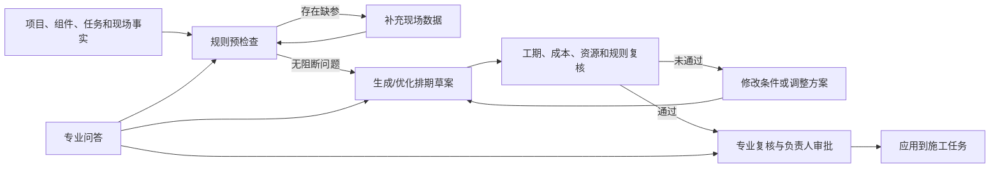

# K Product AI 三大核心业务场景 PRD

| 文档属性 | 内容 |
| --- | --- |
| 版本 | v0.1 |
| 日期 | 2026-07-14 |
| 状态 | 业务讨论稿 |
| 适用范围 | K Product AI 业务规划 |
| 目标读者 | 产品负责人、业务负责人、项目管理人员、计划人员、技术质量安全人员、UE/前端团队、业务后台团队、AI 团队 |

> 本文只描述产品与业务需求，不展开接口、框架、数据库、模型接入或代码实现。涉及当前建设状态时，仅用于区分“已有基础”和“待建设能力”。

## 1. 文档目的

本文用于统一 K Product AI 三大核心业务场景的产品口径：

1. 专业对话问答。
2. AI 排期方案生成与优化。
3. 项目规则校验与解释。

希望通过本文回答以下业务问题：

- 产品主要为谁服务？
- 三个场景分别解决什么问题？
- 用户在什么情况下使用？
- 需要提供哪些业务信息？
- 系统应该返回什么结果？
- 哪些结果只能作为建议，哪些可以作为可信判断？
- 缺少信息、出现冲突或结果不通过时如何处理？
- 结果如何复核、审批、应用和追溯？
- 第一阶段做什么，暂时不做什么？
- 最终如何验收产品价值？

本文可直接作为后续产品评审、跨团队讨论、原型设计、需求拆分和业务验收的基础材料。

## 2. 产品背景

K 产品目前围绕工程项目管理，已经涉及或规划涉及以下业务信息：

- 项目、标段、作业面和空间场景。
- 施工组件、工程量、材料类型和施工工艺。
- 施工任务、子工序计划、开始时间和完成期限。
- 项目规则、企业规则、质量安全要求和施工建议。
- 可用人工、班组、机械设备和现场资源。
- 预算、单价、成本上限和成本明细。
- 规范、工法、施工经验、历史案例和技术资料。

随着项目数据增加，用户会面临三个典型问题：

### 2.1 信息难查

工程资料分散，规范、工法、企业经验和项目说明不容易快速定位。用户遇到问题时，需要在大量文档或系统页面中查找答案。

### 2.2 方案难编

施工排期需要同时考虑工序、工期、资源、成本、天气、现场条件和项目规则。人工编制耗时，且容易遗漏约束。

### 2.3 规则难核

项目规则数量多、表达方式不同，现场数据又来自多个页面或 UE 场景。用户很难快速判断当前情况是否满足全部规则，也难以解释不通过的原因。

K Product AI 希望在不改变原有项目管理权责的前提下，用 AI 辅助用户查知识、做方案、核规则，并把结果以清晰、可解释、可追溯的方式交还业务人员。

## 3. 产品定位

### 3.1 一句话定位

> K Product AI 是面向工程项目场景的业务辅助能力，帮助用户基于项目事实和专业知识进行问答、排期与规则校验。

### 3.2 产品价值

| 价值方向 | 业务价值 |
| --- | --- |
| 提高信息获取效率 | 用户可以直接提问，不必反复翻找资料 |
| 降低方案编制成本 | 快速生成结构化施工计划草案，减少从零整理的时间 |
| 提前发现风险 | 在计划执行前识别工期、资源、预算、规则和缺参问题 |
| 提升结果可解释性 | 告诉用户结论、依据、影响和建议，而不是只返回一个结果 |
| 促进业务标准化 | 逐步沉淀统一的知识、规则、计划模板和评审口径 |
| 支持持续优化 | 通过用户反馈、审批结果和实际执行情况改进后续建议 |

### 3.3 产品边界

K Product AI 是辅助决策产品，不是新的项目主数据系统。

- 项目、任务、资源、预算和现场状态仍以原业务系统中的数据为准。
- AI 可以生成建议、草案、解释和风险提示，但不能凭空创造项目事实。
- 涉及施工执行、规则豁免、正式排期和项目状态变更的结果，必须经过明确的业务确认。
- 缺少关键信息时，系统应说明缺少什么，而不是猜测后给出“通过”。
- 能够通过明确规则计算的结论，应以业务规则计算结果为准；AI 主要负责理解、组织和解释。

## 4. 产品目标与非目标

### 4.1 业务目标

#### 目标一：形成专业问答入口

让用户能够围绕工程专业知识、企业标准和具体项目进行提问，并获得有来源、可继续追问的回答。

#### 目标二：形成排期草案生成闭环

让用户基于施工组件、任务、规则、资源和预算生成或优化一份结构化计划草案，并清楚看到计划是否存在风险。

#### 目标三：形成逐规则校验闭环

让用户能够把现场事实与当前项目规则逐条对照，获得通过、失败、缺参、不适用或建议等结果。

#### 目标四：建立统一的复核与追溯口径

让每次问答、排期和规则校验都能说明使用了哪些业务信息、得出了什么结论、由谁确认以及后续如何处理。

### 4.2 第一阶段非目标

- 不自动替代项目经理、计划人员、技术负责人或质量安全人员的最终判断。
- 不允许 AI 直接创建不可撤销的正式施工任务。
- 不一次性覆盖所有工程类型、工艺和规则。
- 不承诺在输入不完整时仍生成可执行方案。
- 不把用户随意上传的资料自动视为企业正式标准。
- 不在第一阶段实现完全自动化的多项目排产。
- 不把所有现场动作都交给 AI 自主决定。

## 5. 核心产品原则

### 5.1 事实优先

项目工程量、预算、资源、进度和现场状态必须来自明确的业务来源。AI 不得把推测当成项目事实。

### 5.2 缺参不通过

当规则判断或排期需要的关键信息缺失时，系统必须返回“信息不足”及补充清单，不能默认通过。

### 5.3 结果可解释

系统不仅要给出结论，还要说明使用的事实、依据、影响和处理建议。

### 5.4 建议与正式结果分离

AI 生成的内容默认是建议或草案。只有经过复核和审批后，才能成为正式业务结果。

### 5.5 风险显式展示

预算超限、工期冲突、资源不足、规则失败和数据冲突必须明确展示，不能隐藏在大段文字中。

### 5.6 全程可追溯

应能追溯结果对应的项目、任务、数据时间、知识来源、规则版本、修改记录和确认人员。

### 5.7 用户可以纠正

用户应能对回答、计划和规则结果进行反馈、修改、驳回或补充信息，系统不能把 AI 结果视为不可修改的最终答案。

## 6. 用户角色

以下角色是本 PRD 的建议角色，最终名称和权限需要业务团队确认。

| 角色 | 主要诉求 | 典型使用场景 |
| --- | --- | --- |
| 项目负责人/项目经理 | 快速了解风险，确认计划是否可执行 | 查看排期摘要、审批方案、关注阻断规则 |
| 计划/生产管理人员 | 编制和优化施工计划 | 生成排期、调整工序、处理资源和工期冲突 |
| 施工技术人员 | 查询专业知识，解释工艺和规则 | 专业问答、查看规则依据、补充技术说明 |
| 质量管理人员 | 确认质量规则和验收前置条件 | 规则校验、查看失败项和整改建议 |
| 安全管理人员 | 识别安全风险和措施要求 | 规则校验、查看风险等级和施工建议 |
| 现场/UE 操作人员 | 提交现场场景，获取即时提示 | 发起场景校验、补充现场参数、查看结果 |
| 知识管理员 | 维护规范、工法和企业经验 | 上传、审核、更新和停用知识资料 |
| 规则管理员 | 维护标准规则和项目规则 | 新增、修改、发布、停用和查看规则版本 |
| 业务管理员 | 管理使用范围和查看整体效果 | 查看使用情况、处理异常、管理业务权限 |

### 6.1 责任原则

- 生成者可以创建草案，但不一定拥有审批权。
- 规则管理员可以维护规则，但规则变更需要保留版本和生效范围。
- 项目负责人对正式计划应用负责。
- 技术、质量和安全人员对各自专业领域的复核负责。
- 现场人员可以补充事实，但不能自行修改企业级标准规则。

## 7. 三大场景总览

| 场景 | 用户问题 | 产品输出 | 默认业务性质 |
| --- | --- | --- | --- |
| 专业对话问答 | “我想知道答案和依据” | 回答、来源、相关说明、后续建议 | 信息辅助 |
| AI 排期生成与优化 | “请根据当前条件给出一份可讨论的计划” | 计划草案、资源成本、风险、校验结果 | 方案辅助 |
| 项目规则校验 | “当前场景是否符合规则，为什么？” | 总体结论、逐规则结果、证据、整改或补参建议 | 判断辅助 |

当前建议的产品优先级：

1. 先固定规则与排期所需的业务数据口径。
2. 先让规则结果和排期校验具备可信的业务闭环。
3. 再建设带知识来源的专业问答闭环。
4. 最后把三个场景组合成受控的完整业务工作流。

## 8. 场景一：专业对话问答

### 8.1 场景目标

用户可以通过自然语言查询工程专业知识、企业经验、产品说明和项目相关信息，并获得简洁、有依据、可继续追问的回答。

### 8.2 用户故事

#### 用户故事 1：查询专业规范

作为施工技术人员，我希望询问某项工艺的施工要求，并看到答案来自哪份规范，以便快速核对工作方法。

#### 用户故事 2：查询企业经验

作为项目管理人员，我希望了解企业在类似项目中的常见风险和处理措施，以便提前制定预案。

#### 用户故事 3：针对项目追问

作为现场人员，我希望在明确当前项目和任务后连续提问，以便系统结合当前上下文回答，而不是每次重新描述背景。

#### 用户故事 4：无法确认时明确拒答

作为质量管理人员，我希望系统在没有可靠资料时明确说明无法确认，避免把未经证实的内容当成标准。

### 8.3 适用问题范围

第一阶段建议优先支持：

- 施工规范和验收要求解释。
- 企业工法和标准做法查询。
- 常见施工风险和注意事项。
- 质量、安全和技术条款解释。
- 产品使用帮助和业务流程说明。
- 已经授权提供的项目资料问答。

第一阶段不建议直接回答：

- 未经业务系统确认的实时工程量、资源和预算。
- 用户没有权限查看的项目资料。
- 需要正式审批或法律责任认定的问题。
- 没有依据但要求给出确定结论的问题。

### 8.4 前置条件

- 用户已进入允许访问的项目或知识范围。
- 所使用的资料已经完成审核并处于有效状态。
- 项目类问题能够识别当前项目、任务或组件。
- 资料存在失效时间时，应使用当前有效版本。

### 8.5 主业务流程

```text
用户进入问答页面
  -> 选择或自动识别知识范围/当前项目
  -> 输入问题
  -> 系统理解问题并查找相关资料
  -> 生成简洁回答
  -> 展示资料来源和关键依据
  -> 用户继续追问、评价或反馈错误
```

### 8.6 回答内容要求

一条完整回答建议包含：

| 内容 | 说明 |
| --- | --- |
| 直接结论 | 先回答用户最关心的问题 |
| 关键依据 | 说明支持结论的主要内容 |
| 来源 | 展示资料名称、章节或相关片段 |
| 适用范围 | 说明结论适用于什么条件 |
| 风险提示 | 存在限制或不确定性时明确说明 |
| 后续建议 | 告诉用户还可以确认什么或采取什么动作 |

### 8.7 回答状态

| 状态 | 含义 | 用户侧处理 |
| --- | --- | --- |
| 已回答 | 找到充分依据并形成回答 | 展示回答和来源 |
| 部分回答 | 只找到部分依据 | 展示已确认内容和未确认内容 |
| 未找到依据 | 没有找到可靠资料 | 明确提示，不生成确定结论 |
| 信息不足 | 问题缺少项目、对象或条件 | 引导用户补充信息 |
| 存在冲突 | 不同资料或项目事实相互冲突 | 展示冲突来源并要求人工确认 |
| 无权访问 | 用户没有对应资料权限 | 不展示受限内容 |

### 8.8 业务规则

1. 使用专业资料回答时，必须展示来源。
2. 资料来源与回答内容不一致时，不得强行下结论。
3. 没有可靠依据时，应返回“未找到依据”或“无法确认”。
4. 项目实时状态必须以项目业务数据为准，不能从历史文档推断。
5. 用户连续追问时，只能使用当前会话和已授权范围的信息。
6. 不同项目之间的会话信息默认不能混用。
7. 用户可以对回答标记“有帮助”“无帮助”“内容错误”或提交补充说明。
8. 被标记为错误的回答应进入后续业务复核清单。
9. 已失效、未审核或无权限的资料不能作为正式依据。
10. 涉及规则是否通过、计划是否可执行时，应引导用户进入对应业务场景，而不是仅靠问答给出正式结论。

### 8.9 异常与补救流程

#### 情况一：问题过于宽泛

系统应询问用户具体项目、工艺、组件或问题范围。

#### 情况二：资料不足

系统应说明缺少哪类资料，并允许用户转交知识管理员处理。

#### 情况三：资料冲突

系统应列出冲突的资料来源、版本或时间，不能自行选择一个作为最终标准。

#### 情况四：回答被用户投诉

系统应保留问题、回答、来源和用户意见，进入业务复核；复核完成后可以修正资料或回答策略。

### 8.10 第一阶段验收标准

1. 用户可以针对一个明确知识范围提问。
2. 有依据的回答能够展示资料来源。
3. 没有依据时不会伪造确定答案。
4. 用户可以继续追问，并保持当前会话的上下文。
5. 不同项目或用户之间的信息不会错误混用。
6. 用户可以反馈回答是否有帮助或存在错误。
7. 业务人员可以找到一批真实问题验证回答是否正确。
8. 涉及正式规则或计划结论时，系统会提示进入对应场景复核。

## 9. 场景二：AI 排期方案生成与优化

### 9.1 场景目标

帮助计划人员和项目管理人员根据真实施工条件，快速形成一份结构化排期草案，并在正式应用前识别工期、资源、预算和规则风险。

### 9.2 两种业务模式

#### 模式 A：从零生成方案

适用于用户尚未建立详细计划的情况。

系统根据施工组件、任务目标、工序、规则、资源和预算生成一份初始方案草案。

#### 模式 B：优化已有方案

适用于用户已经有计划，但希望检查问题或优化工期、成本和资源配置的情况。

系统应保留原方案，生成优化建议或新版本，并清楚展示与原方案的差异。

第一阶段建议先完成“从零生成单个草案”，已有方案优化作为下一阶段重点能力。

### 9.3 用户故事

#### 用户故事 1：快速生成初稿

作为计划人员，我希望根据一个施工组件和任务约束生成子工序计划，以便减少从零编排的时间。

#### 用户故事 2：发现不可执行问题

作为项目负责人，我希望在审批前看到工期、预算、资源和规则风险，以免不可执行的方案进入正式计划。

#### 用户故事 3：比较优化方向

作为生产管理人员，我希望知道缩短工期会增加哪些资源或成本，以便在工期、成本和风险之间做选择。

#### 用户故事 4：保留人工判断

作为项目经理，我希望 AI 方案先成为草案，并由相关人员复核后再应用，以便保留项目管理责任边界。

### 9.4 排期所需业务信息

| 信息类别 | 主要内容 | 业务责任方 |
| --- | --- | --- |
| 项目信息 | 项目、标段、地点、作业面 | 项目业务系统 |
| 施工组件 | 工程量、材料、工艺、构造和关键参数 | 产品/技术业务 |
| 任务要求 | 计划开始、截止时间、工期、预算、是否允许并行 | 计划/项目管理 |
| 工序信息 | 工序顺序、前置关系、质量停检点 | 技术/计划管理 |
| 上游依赖 | 前置任务及完成状态 | 项目业务系统 |
| 施工规则 | 工序、质量、安全、成本和资源规则 | 规则管理/专业人员 |
| 人工与机械 | 可用类型、数量、班次和时间窗口 | 生产/资源管理 |
| 成本依据 | 材料、人工、机械和措施单价 | 成本管理 |
| 现场条件 | 出入口、作业面、运输、临电、塔吊覆盖等 | 项目现场 |
| 日历与天气 | 工作日、节假日、工时、天气和停工要求 | 项目管理/外部信息 |
| 已知风险 | 供应、交叉作业、环境和验收风险 | 项目团队 |
| 原方案 | 已有任务、日期、资源和成本 | 计划人员，仅优化模式使用 |

### 9.5 生成前检查

系统在生成方案前应检查：

- 是否明确了目标组件和任务。
- 是否有计划开始时间和完成期限。
- 是否有必要的工程量和工序信息。
- 是否有关键前置任务状态。
- 是否有影响执行的强制规则。
- 是否有基本资源范围。
- 是否有预算约束或明确说明暂不做预算判断。
- 是否明确使用工作日还是自然日。

如缺少关键数据，应先返回补充清单。用户可以选择补充后再生成，或在明确风险的前提下生成仅供讨论的低可信草案。

### 9.6 主业务流程

```text
用户选择项目、组件和任务
  -> 选择“新建方案”或“优化已有方案”
  -> 系统汇总施工条件
  -> 检查缺失和冲突信息
  -> 用户确认目标：综合平衡/工期优先/成本优先
  -> 生成排期草案
  -> 检查工期、依赖、成本、资源和规则
  -> 展示方案、风险和待确认事项
  -> 用户调整或重新生成
  -> 专业人员复核
  -> 项目负责人审批
  -> 应用到施工任务管理器
```

### 9.7 方案输出内容

一份完整排期草案建议包含：

| 内容 | 说明 |
| --- | --- |
| 方案摘要 | 总工期、预计完成时间、成本和主要组织方式 |
| 前提与假设 | 方案成立所依赖的条件 |
| 子工序计划 | 工序、顺序、工期、开始结束时间和前置关系 |
| 人工机械计划 | 各阶段需要的班组、人员和机械 |
| 成本明细 | 材料、人工、机械和措施费用 |
| 规则符合情况 | 每条关键规则的处理情况 |
| 风险与注意事项 | 天气、供应、交叉作业、验收等风险 |
| 优化说明 | 为什么采用当前组织方式 |
| 待确认事项 | 仍需项目人员确认的信息 |
| 校验结果 | 哪些检查通过、哪些未通过 |

### 9.8 方案状态

| 状态 | 含义 | 允许动作 |
| --- | --- | --- |
| 数据待补充 | 关键信息不完整 | 补充信息、取消 |
| 生成中 | 正在形成草案 | 等待、取消 |
| 草案已生成 | 已形成可查看方案 | 编辑、重生成、提交复核 |
| 校验未通过 | 存在阻断问题 | 查看问题、修改、重生成 |
| 待专业复核 | 等待计划/技术/质量/安全复核 | 通过、驳回、补充意见 |
| 待负责人审批 | 专业复核完成 | 批准、驳回 |
| 已批准 | 可以应用到业务计划 | 应用、撤销批准 |
| 已应用 | 已进入正式施工任务 | 查看来源、生成新版本 |
| 已驳回 | 当前方案不采用 | 修改、复制为新草案 |
| 已失效 | 项目事实或规则变化，原方案不再有效 | 重新生成或重新复核 |

### 9.9 业务规则

1. AI 生成结果默认是草案，不得自动成为正式计划。
2. 方案不得使用不存在的工程量、资源或预算事实。
3. 关键输入缺失时，应明确标注假设和风险。
4. 任何阻断级规则失败时，方案不能进入批准状态。
5. 工期超过截止时间时，必须标记为校验未通过。
6. 资源超过可用上限时，必须标记资源冲突。
7. 成本超过预算时，必须标记预算超限。
8. 前置任务未完成且不允许并行时，后续工序不能直接开始。
9. 质量停检点未完成时，相关后续工序不能进入可执行状态。
10. 天气、夜间施工和现场限制必须作为风险或限制条件展示。
11. 用户调整 AI 方案后，修改内容必须保留记录。
12. 项目事实、规则或资源发生重大变化后，已批准但未执行的方案应重新检查。
13. 优化已有方案时，必须保留原方案并展示差异，不能直接覆盖。
14. 正式应用前必须记录复核人、审批人和时间。
15. 用户应能查看方案为什么这样安排，而不只是看到日期表格。

### 9.10 不同目标的业务含义

| 目标 | 优先考虑 | 不应忽略 |
| --- | --- | --- |
| 综合平衡 | 在工期、成本、资源和风险之间平衡 | 所有强制约束 |
| 工期优先 | 尽量提前完成 | 预算、资源上限和安全质量规则 |
| 成本优先 | 尽量降低总成本 | 截止日期、必要资源和强制规则 |

业务团队需要进一步给出不同目标的量化口径，例如工期缩短一天可接受增加多少成本，以及哪些规则永远不能为了优化目标而放宽。

### 9.11 异常与补救流程

#### 情况一：缺少关键输入

返回数据补充清单，不进入正式方案复核。

#### 情况二：规则与项目事实冲突

展示冲突内容和来源，要求业务人员确认，不自动选择一方。

#### 情况三：无法满足全部约束

明确指出无法同时满足的条件，并提供可选调整方向，例如延长工期、增加资源、调整预算或修改非强制条件。

#### 情况四：生成方案校验失败

保留当前草案和失败原因，允许用户修改输入、选择重新生成或人工编辑。

#### 情况五：项目条件发生变化

已生成方案应标记可能失效，并提示重新检查或生成新版本。

#### 情况六：用户不认可方案

用户可以选择驳回原因，例如工序不合理、资源不可用、成本不准确、风险遗漏或不符合现场经验。

### 9.12 第一阶段验收标准

1. 用户可以基于一个明确组件和任务生成单个排期草案。
2. 方案包含子工序、日期、资源、成本、规则和风险信息。
3. 系统能明确展示工期、预算、资源和规则是否存在问题。
4. 缺少关键数据时会要求补充，而不是无提示地生成确定方案。
5. 校验未通过的方案不能直接进入批准或应用状态。
6. 用户可以修改、重生成、提交复核和驳回。
7. 方案批准后才能应用到施工任务管理器。
8. 可以查看方案对应的项目事实、规则和确认记录。
9. 项目事实变化后，方案能够被识别为需要重新检查。
10. 至少选择一个真实施工组件完成端到端业务验收。

## 10. 场景三：项目规则校验与解释

### 10.1 场景目标

帮助用户把当前项目或 UE 场景事实与项目规则逐条对照，快速识别符合项、失败项、缺参项、建议项和不适用项，并给出可理解的原因和后续动作。

### 10.2 典型触发方式

| 触发方式 | 说明 |
| --- | --- |
| 用户主动检查 | 用户选择场景并发起“是否符合规则”的检查 |
| 施工操作前检查 | 在关键施工操作前检查必要条件 |
| 排期方案检查 | 计划生成或修改后检查是否符合规则 |
| 数据变化后复查 | UE 场景、资源、任务或规则变化后重新检查 |
| 审批前检查 | 方案或任务提交审批前执行规则检查 |

### 10.3 用户故事

#### 用户故事 1：判断当前场景

作为现场人员，我希望知道当前土质、开挖深度和现场条件是否符合项目规则，以便在操作前发现风险。

#### 用户故事 2：逐条查看原因

作为质量安全人员，我希望看到每条规则的事实、条件、结果和建议，以便快速定位需要整改的内容。

#### 用户故事 3：发现缺失数据

作为项目管理人员，我希望系统告诉我哪些规则因为缺少数据无法判断，以便安排现场补采。

#### 用户故事 4：管理项目差异

作为规则管理员，我希望企业标准规则可以被项目引用，并允许项目在授权范围内增加补充规则，以便适应不同项目。

### 10.4 规则来源

规则建议分为：

| 规则类型 | 说明 | 修改原则 |
| --- | --- | --- |
| 企业标准规则 | 企业统一的质量、安全、技术和管理要求 | 项目一般不能直接修改，只能引用或申请例外 |
| 工艺标准规则 | 针对具体施工工艺的标准要求 | 由专业部门维护 |
| 项目补充规则 | 项目根据合同、现场和管理要求增加的规则 | 由项目授权人员维护 |
| 临时控制规则 | 针对特定时间、区域或风险的临时要求 | 必须有生效和失效时间 |
| 建议类规则 | 不直接判定失败，但提供优化或施工措施 | 命中条件时给出建议 |

每条规则至少需要明确：

- 规则编码和名称。
- 规则类型和适用范围。
- 风险等级或严重程度。
- 判断需要的现场参数。
- 通过、失败或建议条件。
- 缺少参数时需要补充什么。
- 规则来源、版本、生效时间和维护人。
- 失败后的处理要求。

### 10.5 校验所需信息

| 信息 | 说明 |
| --- | --- |
| 当前项目和场景 | 明确规则适用于哪个项目、组件或作业面 |
| 启用规则 | 当前项目实际生效的规则集合 |
| UE/现场事实 | 当前材料、尺寸、深度、状态、资源等现场信息 |
| 用户补充事实 | 用户在问题中明确提供的现场信息 |
| 数据时间 | 判断使用的是哪个时间点的数据 |
| 规则版本 | 判断使用的是哪一个规则版本 |

### 10.6 单条规则结果

| 结果 | 业务含义 | 后续动作 |
| --- | --- | --- |
| `PASS` 通过 | 已知事实满足规则 | 无需整改，可继续后续流程 |
| `FAIL` 失败 | 已知事实明确不满足规则 | 展示原因和整改要求 |
| `MISSING_INPUT` 信息不足 | 缺少判断所需事实 | 补充数据后重新检查 |
| `NOT_APPLICABLE` 不适用 | 当前场景不适用该规则 | 记录不适用原因 |
| `ADVICE` 建议 | 条件命中，需要给出措施或优化建议 | 生成建议事项，不单独视为失败 |

### 10.7 总体结果

| 总体结果 | 判定口径 |
| --- | --- |
| 通过 | 没有失败规则，也没有信息不足规则 |
| 不通过 | 至少一条需要检查的规则失败 |
| 信息不完整 | 没有失败规则，但至少一条规则因缺参无法判断 |

总体结果优先级：

```text
不通过 > 信息不完整 > 通过
```

只要存在失败规则，总体结果必须是不通过，即使同时还有信息不足规则。

### 10.8 严重程度与业务动作

| 严重程度 | 建议业务动作 |
| --- | --- |
| 阻断级 | 失败时不得进入自动执行或正式批准，必须整改或完成例外审批 |
| 警告级 | 必须提示风险并由责任人确认，是否允许继续由业务制度决定 |
| 提示级 | 作为优化建议或注意事项展示 |

警告级规则是否允许“确认后继续”，需要由质量、安全和项目管理制度最终确认。

### 10.9 主业务流程

```text
用户进入当前项目/UE 场景
  -> 系统获取现场事实和当前生效规则
  -> 检查规则所需参数是否完整
  -> 逐条对照规则与事实
  -> 形成单条结果、原因、证据和建议
  -> 计算总体结论
  -> 展示失败项、缺参项和建议项
  -> 用户补参、整改、申请例外或重新检查
  -> 保存检查与处理记录
```

### 10.10 结果展示要求

规则检查结果应优先展示：

1. 总体是否通过。
2. 阻断级失败数量。
3. 警告数量。
4. 缺参数量。
5. 需要立即处理的事项。

每条规则明细应包含：

| 内容 | 说明 |
| --- | --- |
| 规则名称和编码 | 标识是哪条规则 |
| 严重程度 | 阻断、警告或提示 |
| 判断结果 | 通过、失败、缺参、不适用或建议 |
| 已知事实 | 本次判断使用的现场数据 |
| 规则要求 | 本次对照的规则条件 |
| 判断原因 | 为什么得到当前结果 |
| 证据来源 | 事实来自哪里、什么时间 |
| 整改/补参建议 | 用户下一步需要做什么 |

### 10.11 业务规则

1. 每条当前生效规则必须有且只有一个结果。
2. 缺少关键参数时，该规则不能判定为通过。
3. 现场事实和用户补充内容冲突时，应判定为信息不足并要求确认。
4. 规则名称、严重程度和版本必须与当前生效规则一致。
5. 规则结果不能脱离输入规则自行新增规则。
6. 总体结果必须由全部单条结果统一计算，不能单独填写。
7. 建议类规则命中时返回建议，不命中时返回不适用。
8. 规则不适用时必须说明原因，不能简单忽略。
9. 阻断级规则失败时，相关计划或操作不能自动通过。
10. 规则变更后，使用旧版本形成但尚未完成的检查应提示重新检查。
11. 用户补参或现场整改后，应生成新的检查记录，不覆盖原记录。
12. 项目规则例外必须保留申请人、原因、审批人、有效期和适用范围。
13. AI 可以解释复杂规则，但能明确计算的条件必须按业务规则计算。
14. 规则检查结果应区分“检查完成”和“业务通过”，避免用户误解。

### 10.12 异常与补救流程

#### 情况一：缺少现场参数

列出缺少字段、对应规则和采集建议，用户补充后重新检查。

#### 情况二：规则条件无法理解

标记为需要规则管理员复核，不能默认通过。

#### 情况三：规则之间冲突

展示冲突规则、来源和版本，提交专业人员确认优先级。

#### 情况四：现场事实冲突

展示不同来源的值和时间，要求用户选择权威事实或重新采集。

#### 情况五：用户申请例外

生成例外申请，由具有权限的人员审批；例外必须限定范围和有效期。

#### 情况六：检查结果被质疑

保留原始事实、规则和结果，允许发起人工复核并记录最终意见。

### 10.13 第一阶段验收标准

1. 用户可以针对一个明确场景执行规则检查。
2. 检查结果覆盖全部当前输入规则，不遗漏、不重复。
3. 单条结果能够展示事实、规则条件、原因和建议。
4. 缺少参数时不会判定为通过。
5. 存在失败规则时总体结果一定是不通过。
6. 阻断级失败能够明确提示并阻止自动通过。
7. 用户补参或整改后可以重新检查，并保留历史记录。
8. 每次检查能够追溯项目、场景、规则版本和数据时间。
9. 至少用一批真实 UE 场景和业务期望结果完成验收。
10. 业务专家能够对结果标记正确、错误或需要调整。

## 11. 三大场景协同流程

### 11.1 推荐完整业务链路



### 11.2 协同使用示例

1. 用户进入筏板基础施工任务。
2. 系统先检查前置验收、现场参数和关键规则。
3. 缺少当前水位或资源信息时，提示现场补充。
4. 信息完整后生成排期草案。
5. 系统检查工期、预算、资源峰值和施工规则。
6. 计划人员调整方案并提交技术、质量、安全复核。
7. 项目负责人批准后应用到施工任务管理器。
8. 用户可以通过专业问答了解某条规则来源或方案安排原因。

### 11.3 场景之间的边界

- 问答负责解释，不直接替代规则检查。
- 规则检查负责判断是否满足要求，不负责独立生成完整排期。
- 排期负责组织方案，但必须接受规则与业务约束复核。
- 三个场景都不能绕过正式审批直接改变项目状态。

## 12. 核心业务对象

| 业务对象 | 说明 | 主要维护方 |
| --- | --- | --- |
| 项目 | 业务归属和权限边界 | 项目业务系统 |
| 标段/作业面 | 具体施工范围 | 项目团队 |
| 施工组件 | 工程量、材料和工艺的组合 | 产品/技术团队 |
| 施工任务 | 计划目标、期限、预算和状态 | 计划/项目管理 |
| 子工序 | 排期中的具体工作项 | 计划/技术团队 |
| 规则 | 对现场、工艺、资源、质量安全和成本的要求 | 规则管理员/专业部门 |
| 现场事实 | UE 或业务系统采集的当前状态 | 现场/项目团队 |
| 资源 | 班组、人工、机械及可用时间 | 生产/资源管理 |
| 成本依据 | 单价、预算和费用口径 | 成本管理 |
| 知识资料 | 规范、工法、经验和说明 | 知识管理员 |
| 排期方案 | AI 或人工形成的计划草案及版本 | 计划人员 |
| 规则检查记录 | 某次场景与规则的判断结果 | 系统生成、专业人员复核 |
| 审批记录 | 复核、批准、驳回和例外信息 | 对应责任人 |

### 12.1 数据时效原则

- 实时项目状态必须标记数据时间。
- 规则必须标记版本和生效时间。
- 知识资料必须标记审核状态和有效性。
- 排期方案必须记录生成时使用的数据版本。
- 关键数据变化后，系统应提示相关方案或检查结果可能失效。

## 13. 权限与业务操作

建议的初始权限矩阵如下，最终以企业制度为准。

| 操作 | 现场人员 | 计划人员 | 技术/质量/安全 | 项目负责人 | 知识管理员 | 规则管理员 |
| --- | --- | --- | --- | --- | --- | --- |
| 发起专业问答 | 是 | 是 | 是 | 是 | 是 | 是 |
| 查看授权项目资料 | 是 | 是 | 是 | 是 | 按授权 | 按授权 |
| 生成排期草案 | 否/按授权 | 是 | 可查看 | 是 | 否 | 否 |
| 编辑排期草案 | 否 | 是 | 提意见 | 是 | 否 | 否 |
| 专业复核方案 | 否 | 是 | 是 | 是 | 否 | 按规则领域 |
| 批准正式方案 | 否 | 否/按授权 | 否/按授权 | 是 | 否 | 否 |
| 发起规则检查 | 是 | 是 | 是 | 是 | 否 | 是 |
| 修改企业规则 | 否 | 否 | 按授权 | 否 | 否 | 是 |
| 新增项目补充规则 | 否 | 否 | 按授权 | 按授权 | 否 | 是 |
| 申请规则例外 | 按授权 | 是 | 是 | 是 | 否 | 否 |
| 审批规则例外 | 否 | 否 | 按制度 | 按制度 | 否 | 按制度 |
| 维护知识资料 | 否 | 否 | 可提交 | 否 | 是 | 可提交 |

## 14. 业务通知与待办

产品应在以下情况下形成明确通知或待办：

- 问答找不到依据且用户申请补充资料。
- 回答被用户标记为错误。
- 排期缺少关键输入。
- 排期存在阻断问题或校验失败。
- 方案提交专业复核或负责人审批。
- 方案被驳回或批准。
- 方案使用的数据、规则或资源发生重大变化。
- 规则检查出现阻断级失败。
- 规则检查存在缺参，需要现场补采。
- 规则发生冲突或无法理解，需要管理员处理。
- 规则例外即将到期。

每条待办至少应包含项目、业务对象、问题摘要、责任人、截止时间和处理入口。

## 15. 业务指标

### 15.1 专业问答指标

| 指标 | 说明 |
| --- | --- |
| 有依据回答率 | 有可靠来源的问题中，成功返回来源的比例 |
| 正确拒答率 | 没有依据时正确说明无法确认的比例 |
| 用户有帮助率 | 用户评价“有帮助”的回答比例 |
| 错误反馈率 | 被标记为错误或误导的比例 |
| 平均问题解决时间 | 从提问到用户获得可用答案的时间 |
| 追问完成率 | 用户通过连续问答解决问题的比例 |

### 15.2 排期指标

| 指标 | 说明 |
| --- | --- |
| 草案生成时长 | 从数据准备完成到形成草案的时间 |
| 首次校验通过率 | 首次生成草案通过全部检查的比例 |
| 方案采纳率 | 经人工复核后被采用的方案比例 |
| 平均人工调整量 | 用户需要修改的工序、日期或资源数量 |
| 阻断问题发现率 | 在审批前发现重大工期、预算、资源或规则问题的比例 |
| 按期完成改善 | 使用方案后实际按期完成情况的变化 |

### 15.3 规则校验指标

| 指标 | 说明 |
| --- | --- |
| 规则覆盖率 | 每次检查返回全部生效规则结果的比例，目标应为 100% |
| 结果一致率 | 总体结论与逐规则结果一致的比例，目标应为 100% |
| 缺参发现率 | 在执行前识别缺失现场数据的比例 |
| 错误通过率 | 实际不符合但被判断通过的比例，应作为重点控制指标 |
| 人工复核一致率 | 系统结果与专业人员结果一致的比例 |
| 整改闭环率 | 失败规则完成整改并重新通过的比例 |

### 15.4 业务价值指标说明

语义正确率、方案采纳率和工期改善等目标值不能仅由产品团队设定，应由业务专家通过真实项目样本共同确认。第一阶段应先建立基线，再设定上线门槛。

## 16. 第一阶段范围建议

### 16.1 必须完成

#### 专业问答

- 支持一个明确的首批知识范围。
- 回答能够展示来源。
- 没有依据时明确拒答。
- 支持连续追问和用户反馈。

#### AI 排期

- 支持一个明确施工组件的单方案生成。
- 展示工序、工期、资源、成本、规则和风险。
- 展示校验结果和待确认项。
- 方案默认是草案，支持复核、驳回和批准。

#### 规则校验

- 支持一批明确规则和 UE 场景参数。
- 返回全部规则的逐条结果。
- 缺参不能通过，失败优先于信息不足。
- 支持补参、重新检查和历史记录。

#### 公共业务能力

- 统一识别项目、任务、组件和用户。
- 统一记录结果来源和处理状态。
- 统一展示阻断、警告、缺参和待办。

### 16.2 第一阶段暂不包含

- 自动生成多个方案并自动选出“最优方案”。
- 无人工确认直接写入正式施工计划。
- 自动批准规则例外。
- 全企业所有知识资料一次性入库。
- 所有工程工艺和规则类型一次性覆盖。
- 跨项目自动资源调度。
- 基于长期用户画像自动改变正式业务结论。
- 无限制的自主业务操作。

## 17. 后续版本方向

### V1：三大场景最小业务闭环

- 一个知识范围的可追溯问答。
- 一个施工组件的单方案排期草案。
- 一批真实规则和 UE 场景的逐规则校验。
- 基础复核、审批和历史记录。

### V1.5：业务治理增强

- 知识审核、更新和失效管理。
- 规则版本、项目启用关系和例外审批。
- 排期方案版本、差异和已有方案优化。
- 统一业务待办与效果反馈。

### V2：复杂业务协同

- 多方案生成与人工比选。
- 校验失败后的受控调整建议。
- 更完整的日历、天气、资源和成本协同。
- 问答、排期、规则校验的一体化工作台。
- 实际执行结果反馈和计划再优化。

## 18. 端到端验收场景

### 验收场景 1：有依据的专业问答

用户询问一项施工要求，系统返回明确回答、适用条件和资料来源，业务专家确认内容正确。

### 验收场景 2：无依据时拒答

用户询问资料中没有的信息，系统明确说明无法确认，不编造标准条款。

### 验收场景 3：排期数据不足

用户缺少截止时间或关键工程量，系统返回补充清单，不把结果标记为可执行方案。

### 验收场景 4：生成可复核排期草案

用户提交完整组件和任务信息，系统生成包含工序、资源、成本、规则和风险的草案。

### 验收场景 5：排期存在阻断问题

方案超过截止日期、资源上限或预算时，系统明确标记不通过，不能直接批准。

### 验收场景 6：规则检查通过

所有规则均满足且无缺参时，总体结果为通过，逐条结果与总体结论一致。

### 验收场景 7：规则失败与缺参并存

同时存在失败规则和缺参规则时，总体结果为不通过，并分别展示整改和补参要求。

### 验收场景 8：现场事实冲突

UE 场景值与用户补充值冲突时，系统不自行选择，提示确认权威事实后重新检查。

### 验收场景 9：方案审批与应用

排期草案经过专业复核和负责人批准后才能应用，系统保留生成、修改、复核和批准记录。

### 验收场景 10：业务数据变化

已批准方案所依赖的规则、资源或任务条件变化时，系统提示方案需要重新检查。

## 19. 业务风险与应对

| 风险 | 业务后果 | 应对方式 |
| --- | --- | --- |
| 输入数据不完整 | 生成方案或规则结果不可靠 | 生成前检查、缺参清单、禁止默认通过 |
| 现场数据不及时 | 使用过期事实形成错误结论 | 展示数据时间，重大变化触发重新检查 |
| 规则表达不清 | 规则结果不稳定 | 规则标准化、专业审核、无法理解时人工处理 |
| 知识资料失效 | 回答引用旧标准 | 审核、版本、有效期和停用机制 |
| 用户过度信任 AI | 草案被误当成正式结果 | 明确状态、强制复核审批、风险提示 |
| 方案看似完整但不可执行 | 现场落地失败 | 工期、资源、成本、规则和现场条件联合复核 |
| 规则误判为通过 | 引发质量或安全风险 | 失败优先、总体结果统一计算、真实样本验收 |
| 项目权限混乱 | 泄露项目和企业资料 | 按项目和角色控制访问范围 |
| 用户不愿使用 | 产品不能形成价值 | 从高频真实场景切入，保留人工修改和反馈入口 |
| 责任边界不清 | 出现问题时无法追责 | 明确生成、复核、审批和应用责任人 |

## 20. 待业务确认事项

### 20.1 产品定位

- 三个场景分别是信息建议、业务判断、审批辅助还是自动执行？
- 哪些结论可以直接展示，哪些必须经过专业复核？

### 20.2 首批范围

- 第一批支持哪个项目、工艺或施工组件？
- 第一批知识资料和规则由谁提供？
- 选择哪些真实场景作为验收样本？

### 20.3 角色与权限

- 谁可以生成方案？
- 谁负责专业复核？
- 谁拥有最终批准权？
- 谁可以修改企业规则和项目规则？
- 谁可以查看跨项目数据？

### 20.4 排期业务

- 第一阶段只做新方案，还是同时做已有方案优化？
- 正式计划应用前需要哪些人员会签？
- 工期、成本和资源冲突的业务优先级是什么？
- 方案批准后是否允许撤销或重新生成？

### 20.5 规则业务

- 企业规则与项目补充规则如何合并？
- 警告级失败是否允许确认后继续？
- 哪些规则必须阻断施工操作？
- 规则例外由谁审批，最长有效期是多少？

### 20.6 问答业务

- 没有资料依据时是否允许提供通用参考建议？
- 来源需要精确到文档、章节、页码还是原文片段？
- 项目实时信息是否允许进入问答上下文？
- 用户反馈错误后由谁负责处理？

### 20.7 验收指标

- 问答正确率、有帮助率和错误率目标是多少？
- 排期方案采纳率和人工调整量目标是多少？
- 规则检查与人工复核的一致率目标是多少？
- 哪些指标达标后才允许进入真实项目使用？

## 21. 评审会议建议

建议按以下顺序评审本文：

1. 确认产品定位和责任边界。
2. 确认三类用户和首批使用场景。
3. 确认第一阶段项目、组件、知识和规则范围。
4. 逐项确认三大场景主流程和异常流程。
5. 确认草案、复核、审批和应用状态。
6. 确认阻断、警告、缺参和例外的业务口径。
7. 确认验收样本、业务负责人和目标指标。
8. 形成版本范围、责任人和时间计划。

每项决策建议记录：

| 字段 | 内容 |
| --- | --- |
| 决策项 | 本次需要确定的问题 |
| 最终口径 | 会议确定的唯一业务结论 |
| 适用范围 | 项目、角色、场景和版本 |
| 业务负责人 | 对口径和验收负责的人 |
| 配合团队 | 产品、业务后台、UE/前端、AI、测试等 |
| 完成时间 | 交付或确认日期 |
| 验收方式 | 真实数据、原型、业务测试或审批记录 |
| 风险与替代方案 | 无法按期完成时的处理方式 |

## 22. 总结

K Product AI 的三大核心业务场景可以概括为：

- **问答**解决“用户不知道去哪里找答案”的问题。
- **排期**解决“用户难以快速形成完整施工计划草案”的问题。
- **规则校验**解决“用户难以逐条判断当前场景是否符合要求”的问题。

三者共同依赖真实、完整、可追溯的项目事实，但承担不同责任：

- 问答提供知识和解释。
- 排期提供方案和优化建议。
- 规则校验提供逐条判断和风险提示。

第一阶段最重要的不是追求完全自动化，而是做到：

1. 输入来源清楚。
2. 缺少信息时不猜测。
3. 结果有依据、有状态、有风险提示。
4. 重要结果经过人工复核和审批。
5. 所有业务动作可以追溯和撤回。

在这些业务基础稳定后，再逐步扩展多方案比选、复杂协同、自动调整和执行反馈，能够更稳妥地把 AI 从演示能力发展为项目真正愿意使用的业务工具。
