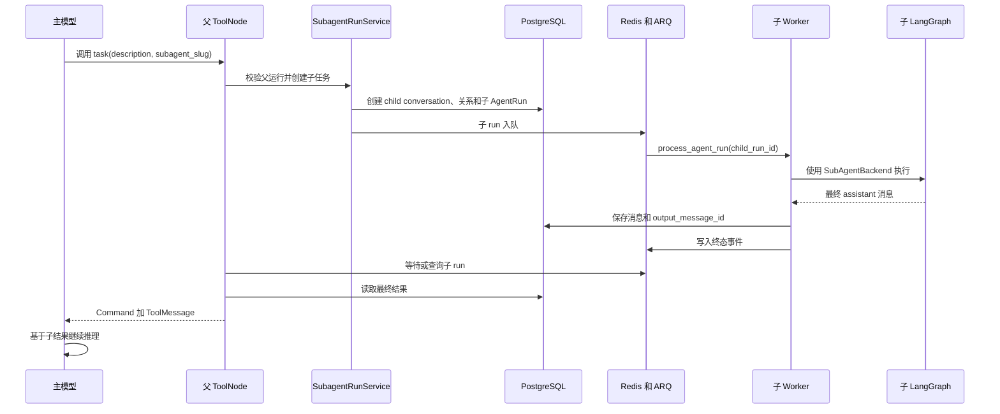

# 主智能体调用子智能体：运行链路与结果回传

本文面向需要维护、调试或扩展 Yuxi 多智能体模块的开发者，说明主智能体如何发起子任务、子任务如何进入独立 Worker 运行、最终结果如何返回主 LangGraph，以及同步调用、异步调用、状态面板和文件作用域之间的关系。

如果只需要了解如何在界面中创建和配置子智能体，请先阅读[子智能体](/agents/subagents-management)。本文重点解释运行时内部实现。

## 1. 先建立正确的心智模型

Yuxi 没有把子智能体作为主 LangGraph 中一个直接调用的 Python 子函数，也没有把子智能体的完整 graph state 合并到父 graph。当前实现是：

1. 主模型通过 `task` 或 `subagent_*` 工具表达委派意图。
2. 工具创建一个独立的子 `AgentRun`，并将它投递到与普通对话相同的 ARQ Worker 队列。
3. 子 Worker 使用 `SubAgentBackend` 和独立 child thread 执行子智能体。
4. 子智能体最终 assistant 消息先保存到自己的 child conversation。
5. 父工具等待或查询子 run，从数据库读取最终结果。
6. 父工具把结果包装成与原始 `tool_call_id` 对应的 `ToolMessage`，通过 LangGraph `Command` 写回父状态。
7. 主模型读取该工具结果，继续推理、调用其他工具或生成最终回答。

从主模型视角看，它像一次工具调用；从系统视角看，它是一条跨越 LangGraph、PostgreSQL、Redis 和 Worker 的持久化运行链路。



## 2. 三个不能混淆的身份

理解调用链时，必须区分 `tool_call_id`、`run_id` 和 `child_thread_id`。

| 标识 | 生命周期 | 主要用途 |
|---|---|---|
| `tool_call_id` | 一次父模型工具调用 | 关联父 `AIMessage.tool_calls` 和返回的 `ToolMessage` |
| `run_id` | 一次真实子智能体执行 | 查询状态、等待、取消、订阅事件、读取最终结果 |
| `child_thread_id` | 子智能体长期上下文 | LangGraph checkpoint、child conversation、后续续跑 |

一个 child thread 可以先后创建多个 run。每次 run 是一次执行；每次父模型调用工具又会产生自己的 `tool_call_id`。

父状态中的 `subagent_runs` 以 `run_id` 为更新身份，不会因为两个 run 使用同一个 child thread 就把它们当成同一次执行。

相关实现：

- `backend/package/yuxi/agents/buildin/chatbot/state.py`
- `backend/package/yuxi/storage/postgres/models_business.py`
- `backend/package/yuxi/utils/hash_utils.py`

## 3. 关键代码地图

| 职责 | 文件 |
|---|---|
| 主智能体构图和 middleware 装配 | `backend/package/yuxi/agents/buildin/chatbot/graph.py` |
| 子智能体构图和工具限制 | `backend/package/yuxi/agents/buildin/subagent/graph.py` |
| 子智能体工具、提示词和结果包装 | `backend/package/yuxi/agents/middlewares/subagent_task.py` |
| 父子线程关系和子 run 创建 | `backend/package/yuxi/services/subagent_run_service.py` |
| 通用 AgentRun 创建、等待、结果读取和取消 | `backend/package/yuxi/services/agent_run_service.py` |
| Worker 消费和 run 终态处理 | `backend/package/yuxi/services/run_worker.py` |
| Agent 配置解析、graph 执行和消息落库 | `backend/package/yuxi/services/chat_service.py` |
| AgentRun 数据访问 | `backend/package/yuxi/repositories/agent_run_repository.py` |
| 父子线程关系数据访问 | `backend/package/yuxi/repositories/subagent_thread_repository.py` |
| `AgentRun`、`SubagentThread` 数据模型 | `backend/package/yuxi/storage/postgres/models_business.py` |

维护时优先从 `subagent_task.py` 和 `subagent_run_service.py` 开始阅读：前者负责模型工具协议，后者负责持久化运行边界。

## 4. 主智能体构图时如何获得调用能力

`ChatbotAgent.get_graph()` 会先准备当前 Agent 的运行配置，再构造 LangChain `create_agent` graph。构图期间 `_build_middlewares()` 调用：

```python
subagent_middleware = await create_subagent_task_middleware(context)
if subagent_middleware:
    middlewares.append(subagent_middleware)
```

`create_subagent_task_middleware()` 按以下规则加载允许的子智能体：

1. 读取 `context.subagents`。
2. 使用当前运行 `uid` 加载用户。
3. 如果显式配置了 slug，只加载配置中存在、当前用户可见且 `is_subagent=true` 的 Agent。
4. 如果未配置或保存为空列表，加载当前用户可见的全部子智能体。
5. 如果最终列表为空，不挂载 middleware，也不向模型提供子智能体工具。

Middleware 初始化后会：

- 将可用子智能体的 slug、名称和调用原则追加到系统提示词；
- 注册同步 `task` 工具；
- 注册 `subagent_start`、`subagent_status`、`subagent_cancel`、`subagent_await` 四个异步生命周期工具。

这里没有确定性业务路由器替模型判断任务复杂度。是否调用、调用哪个子智能体、如何编写 `description`，由主模型根据系统提示、用户请求和工具描述决定。

::: warning 配置语义
`subagents=[]` 表示使用当前用户可见的全部子智能体，不表示禁用。需要禁止某个主 Agent 使用子智能体时，不能依赖保存空列表表达，应从运行配置语义、权限范围或后续明确的禁用机制处理。
:::

## 5. 同步 `task` 的完整调用过程

同步 `task` 适用于父模型必须拿到子结果才能继续推理的任务。它的参数是：

```python
description: str
subagent_slug: str
thread_id: str | None = None
```

### 5.1 主模型产生工具调用

父 LangGraph 中会先出现带工具调用的 `AIMessage`：

```json
{
  "tool_calls": [
    {
      "id": "call_sales_01",
      "name": "task",
      "args": {
        "description": "读取销售表，分析下降原因并给出结构化结论。",
        "subagent_slug": "general-purpose"
      }
    }
  ]
}
```

LangGraph 执行工具时，会通过 `ToolRuntime` 把 `tool_call_id=call_sales_01` 传给 Yuxi middleware。

### 5.2 `_start_subagent()` 校验父运行

`YuxiSubAgentMiddleware._start_subagent()` 会检查：

- `subagent_slug` 是否在当前 middleware 的允许列表；
- `ToolRuntime` 是否包含 `tool_call_id`；
- 父 context 是否包含 `uid`；
- 父 context 是否包含当前 `run_id`。

然后将 `description` 转成标准 `AgentRunInputMessage`。对子智能体而言，这段描述就是它收到的用户消息，因此描述应包含完整目标、必要上下文和期望输出，不能只写“继续处理”之类依赖父模型隐含上下文的短句。

### 5.3 创建或校验 child thread

没有传入 `thread_id` 时，使用以下输入确定性生成 child thread：

```text
parent_thread_id + subagent_slug + tool_call_id
```

当前结果格式是：

```text
subagent_<sha256 digest>
```

生成函数为：

```python
subagent_child_thread_id(parent_thread_id, agent_slug, tool_call_id)
```

如果传入 `thread_id`，系统将其视为续跑请求，并校验：

- child thread 是否属于当前用户；
- 是否属于当前父 conversation；
- 是否绑定到请求中的子智能体；
- 是否存在 `SubagentThread` 关系。

续跑不会直接复用旧 run，而是在相同 child thread 上创建新的 run。若该线程已有活跃 run，则返回 `busy`，不会隐藏排队。

### 5.4 建立持久化关系

首次调用会创建：

1. `status=subagent` 的 child conversation；
2. 一条 `SubagentThread` 父子线程关系；
3. 一条 `run_type=subagent` 的 `AgentRun`；
4. 一条保存任务描述的 child conversation 用户消息。

子 run 的关键关系字段是：

```text
AgentRun.created_by_run_id = 父 run ID
AgentRun.subagent_thread_relation_id = SubagentThread.id
AgentRun.conversation_thread_id = child thread ID
AgentRun.agent_slug = 子智能体 slug
```

`SubagentRunService.start()` 会拒绝以 `run_type=subagent` 的 run 作为创建者，从服务边界固化“不支持孙级子智能体”的约束。

### 5.5 固化子运行时上下文

子 run 的 `input_payload` 保存模型快照和最小运行时信息：

```json
{
  "model_spec": "provider:model",
  "runtime": {
    "tool_call_id": "call_sales_01",
    "subagent_name": "通用子智能体",
    "parent_thread_id": "parent-thread",
    "file_thread_id": "parent-thread",
    "skills_thread_id": "subagent_..."
  }
}
```

子智能体使用自己的 Agent 配置，包括工具、知识库、MCP、Skills 和系统提示词。如果子智能体没有显式配置模型，middleware 会将父智能体当前运行模型作为本次子 run 的模型覆盖。

### 5.6 提交并入队

只有数据库事务提交成功后，才调用：

```python
await enqueue_agent_run(run.id)
```

相同 `request_id` 的幂等命中不会重复入队。同一用户、同一 Agent 和同一 conversation thread 已有非终态 run 时，统一由 AgentRun 创建边界返回 `run_busy`。

## 6. 子 Worker 如何执行子智能体

子 run 与普通聊天 run 共用 `process_agent_run()`。Worker 从持久化记录恢复：

- `run_type`；
- `agent_slug`；
- `uid`；
- `conversation_thread_id`；
- 输入消息；
- `model_spec`；
- 子运行时 thread 信息。

当 `run_type == "subagent"` 时，Worker 将 `parent_thread_id`、`file_thread_id`、`skills_thread_id` 写入 `meta`，随后调用统一的 `stream_agent_chat()`。

`stream_agent_chat()` 会按：

```python
agent_kind = "subagent"
```

加载 Agent，避免普通聊天入口调用子 Agent 或子运行错误加载主 Agent。它使用 `SubAgentBackend` 构建真实 graph，并以 child thread 作为 LangGraph checkpoint thread。

`SubAgentBackend` 与普通聊天 Agent 使用相似的模型、文件系统、附件、Skills、Summary、Todo 和 token usage middleware，但不会挂载子智能体 middleware，并过滤：

- `present_artifacts`
- `ask_user_question`
- `install_skill`

因此子智能体不能自行向用户发起交互、安装 Skill 或继续创建下一层子智能体。

## 7. 子结果如何成为可读取的最终结果

子 graph 运行结束后，`chat_service.save_messages_from_langgraph_state()` 会重新读取 child checkpoint，将尚未落库的 assistant/tool 消息保存到 child conversation。

如果存在最终 assistant 消息，还会执行：

```python
AgentRunRepository.set_output_message(run_id, last_ai_message.id)
```

之后 `stream_agent_chat()` 才发出 `status=finished`。Worker 收到该 chunk 后：

1. 将子 run 标记为 `completed`；
2. 向 Redis run 事件流写入 `end`；
3. 保证父侧收到终态时，最终消息已经可以从数据库读取。

失败、取消和中断分别落为 `failed`、`cancelled`、`interrupted`，并保存 `error_type` 和 `error_message`。

## 8. 同步结果如何写回父 LangGraph

`task` 创建子 run 后调用：

```python
await_agent_run_result(
    run_id=child_run_id,
    current_uid=parent_uid,
)
```

该函数消费子 run 的有限 Redis/SSE 事件流，直到收到终态或达到等待上限。结束后再通过独立数据库会话读取最终结果：

```json
{
  "status": "completed",
  "output": "子智能体最终回答",
  "agent_slug": "general-purpose",
  "thread_id": "subagent_...",
  "agent_run_id": "child-run-id",
  "final_message_id": 123
}
```

结果选择顺序是：

1. 优先读取 `AgentRun.output_message_id` 指向的 assistant 消息；
2. 没有显式输出消息时，回退到 child conversation 最后一条 assistant 消息。

父工具随后返回：

```python
Command(
    update={
        "messages": [
            ToolMessage(
                content=tool_result,
                tool_call_id=parent_tool_call_id,
            )
        ],
        "subagent_runs": [subagent_run],
    }
)
```

其中 `ToolMessage.content` 的同步格式是：

```text
> 子智能体线程 ID: subagent_...

---

子智能体最终回答
```

### 8.1 为什么必须返回 `ToolMessage`

父模型之前已经产生：

```text
AIMessage.tool_calls[id=call_sales_01, name=task]
```

LangGraph 工具协议要求随后出现：

```text
ToolMessage.tool_call_id=call_sales_01
```

二者通过同一个 `tool_call_id` 配对。`Command` 被 ToolNode 应用后，父消息序列大致变为：

```text
HumanMessage
AIMessage(tool call: task)
ToolMessage(child final result)
```

Agent graph 随后重新进入模型节点。主模型读取 ToolMessage 后，可以整理结果、继续调用工具、调用其他子智能体，或者生成最终回答。

因此，真正进入主模型上下文的是父线程中的 `ToolMessage`，不是 child conversation 中的 assistant 消息对象。

### 8.2 父子历史不会互相合并

父 conversation 最终保存：

- 主模型的 task 工具调用；
- 包含子结果的 ToolMessage；
- 主模型综合后的最终回答。

child conversation 保存：

- 父智能体提供的子任务描述；
- 子智能体自己的工具调用和工具结果；
- 子智能体的 assistant 输出。

父模型默认只能看到子智能体最终结果，看不到完整中间推理轨迹。需要继续同一任务时，通过返回的 child thread ID 续跑，由子 LangGraph 从自己的 checkpoint 恢复历史。

## 9. 异步生命周期工具

长任务或多个可并行子任务不应让父 run 长时间停在同步 `task` 上。此时使用异步工具。

### 9.1 `subagent_start`

它执行与 `task` 相同的校验和子 run 创建，但不等待结果，立即通过 ToolMessage 返回：

```json
{
  "status": "started",
  "run_id": "child-run-id",
  "thread_id": "subagent_...",
  "subagent_slug": "general-purpose",
  "subagent_name": "通用子智能体",
  "created_by_run_id": "parent-run-id",
  "run_status": "pending",
  "continuing": false,
  "subagent_thread_relation_id": 77,
  "events_url": "/api/agent/runs/child-run-id/events",
  "result_url": "/api/agent/runs/child-run-id/result"
}
```

主模型拿到的是运行身份，不是最终结果，可以继续处理其他任务。

::: warning 异步结果不会主动进入模型上下文
子 run 后台完成后，系统不会自动向已经继续运行的父模型插入一条新消息。主模型必须显式调用 `subagent_status` 或 `subagent_await`，最终结果才会通过新的 ToolMessage 进入父上下文。前端可以独立订阅 SSE，但前端收到事件不等于主模型收到结果。
:::

### 9.2 `subagent_status`

按 `run_id` 查询，并先校验该 run 是否由当前父 run 创建。

运行中返回：

```json
{
  "status": "running",
  "run_id": "child-run-id",
  "thread_id": "subagent_...",
  "progress": {
    "last_seq": "9-0",
    "messages": [
      {"kind": "tool_call", "content": "调用工具 read_file"},
      {"kind": "assistant_message", "content": "正在整理结果"}
    ]
  }
}
```

进度来自 Redis 事件流中最近的可读消息摘要，不会把原始事件信封全部放进模型上下文。

当 run 已经终态时，额外返回：

```json
{
  "result": {
    "status": "completed",
    "output": "最终结果"
  }
}
```

### 9.3 `subagent_await`

先校验父 run 归属，再等待指定 `run_id` 终态。完成后将完整结果放入 JSON ToolMessage：

```json
{
  "status": "completed",
  "run_id": "child-run-id",
  "thread_id": "subagent_...",
  "result": {
    "status": "completed",
    "output": "最终结果"
  }
}
```

等待超时时会返回当前快照并设置：

```json
{
  "wait_timed_out": true,
  "message": "子智能体仍在运行，等待最终结果超时；请稍后继续查询。"
}
```

### 9.4 `subagent_cancel`

校验归属后向指定子 run 写入取消请求并发布 Redis 取消信号。HTTP 层取消父 run 时会级联取消其活跃子 run；模型工具 `subagent_cancel` 只取消明确指定的子 run。

## 10. 模型通道与 UI 状态通道

子结果返回存在两条用途不同的通道。

| 通道 | 写入内容 | 消费方 |
|---|---|---|
| `messages` | 与工具调用配对的 `ToolMessage` | 主模型 |
| `subagent_runs` | run 状态、child thread、事件与结果 URL | 前端 Agent 状态面板 |

`ChatBotState.subagent_runs` 使用 reducer 按 `run_id` 增量合并。同一 run 的 `pending → running → completed` 更新同一条状态，不同 run 即使使用同一个 child thread 也保留为不同执行记录。

`chat_service.extract_agent_state()` 将该字段投影为 `agent_state` 流式 chunk，前端据此更新状态面板。运行中的子智能体弹窗可以按 `run_id` 订阅独立 SSE；已完成的子任务从持久化 child Message 历史读取。

不要用 `subagent_runs` 替代 ToolMessage：前者是 UI/状态投影，后者才是模型工具协议。

## 11. 文件系统和 Sandbox 作用域

主、子智能体共享文件时采用拆分作用域：

| 资源 | 主智能体 | 子智能体 |
|---|---|---|
| LangGraph checkpoint | 主 `thread_id` | `child_thread_id` |
| Workspace | 当前 `uid` 的共享工作区 | 相同 `uid` 的共享工作区 |
| Uploads | 主线程文件目录 | 父 `file_thread_id` |
| Outputs | 主线程文件目录 | 父 `file_thread_id` |
| Skills | 主线程 Skills scope | `child_thread_id` 对应的 Skills scope |

因此子智能体可以读取父会话附件，并将输出写回父会话可见的 outputs；但子智能体 Skills 与主智能体隔离。

创建子 run 本身不会立即创建 Sandbox Runtime。只有子智能体实际调用文件系统、`execute`，或触发大结果文件卸载等 Sandbox 操作时，才会按：

```text
uid + file_thread_id + skills_thread_id
```

创建或复用 Runtime。

## 12. 失败、超时和空结果

### 12.1 子 run 失败

如果最终结果没有文本，但 `result.error` 存在，`task` 会把错误消息作为 ToolMessage 内容返回，同时将 `subagent_runs.status` 更新为 `failed`。主模型可以根据错误决定重试、改用其他子智能体或向用户说明。

### 12.2 完成但没有文本

如果 run 已完成，既没有 assistant 文本也没有错误，父工具返回：

```text
子智能体已完成任务，但没有返回文本结果。
```

### 12.3 同步等待超时

`task` 等待达到 SSE 上限但子 run 仍未终态时，不会把它误报为成功，而是返回：

```text
子智能体仍在运行（status: running），尚未返回最终文本结果。
run_id: child-run-id
请稍后使用 subagent_status 或 subagent_await 查询结果；
不要把当前结果视为任务已完成。
```

### 12.4 非法续跑

以下情况会拒绝续跑：

- child thread 不属于当前用户；
- child thread 属于另一个父 conversation；
- child thread 绑定了另一个子智能体；
- 普通 conversation 占用了传入 thread ID；
- 同一 child thread 当前已有活跃 run。

## 13. 一次完整示例

用户请求：

```text
请分析上传的销售表，并给出管理层摘要。
```

主模型发起：

```json
{
  "id": "call_sales_01",
  "name": "task",
  "args": {
    "description": "读取父会话上传的销售表，分析趋势、异常和区域差异，输出带数据依据的结构化结论。",
    "subagent_slug": "general-purpose"
  }
}
```

系统创建：

```text
父 run: parent-run-001
工具调用: call_sales_01
子 thread: subagent_a81d...
子 run: child-run-001
```

子智能体最终保存：

```text
1. 总销售额同比下降 8.4%。
2. 华东区域贡献了主要降幅。
3. A 类产品缺货是首要原因。
4. 建议优先恢复库存并检查渠道转化。
```

父工具写回：

```text
ToolMessage(tool_call_id="call_sales_01")

> 子智能体线程 ID: subagent_a81d...

---

1. 总销售额同比下降 8.4%。
2. 华东区域贡献了主要降幅。
...
```

主模型再次推理，综合为面向用户的最终回答。子智能体完整工具历史仍保留在 child conversation，不会复制到父消息历史。

## 14. 调试方法

### 14.1 先确定三个 ID

排查前先记录：

```text
parent run_id
child run_id
child_thread_id
```

只拿 thread ID 查询 run 状态，或者只拿 run ID判断长期上下文，都容易混淆问题。

### 14.2 检查数据库关系

检查子 run：

```sql
SELECT
    id,
    status,
    run_type,
    agent_slug,
    conversation_thread_id,
    created_by_run_id,
    subagent_thread_relation_id,
    input_message_id,
    output_message_id,
    error_type,
    error_message
FROM agent_runs
WHERE id = '<child-run-id>';
```

检查父子线程关系：

```sql
SELECT
    id,
    uid,
    parent_conversation_id,
    child_conversation_id,
    child_thread_id,
    subagent_slug,
    created_by_run_id
FROM subagent_threads
WHERE child_thread_id = '<child-thread-id>';
```

检查 child conversation 消息：

```sql
SELECT id, role, content, run_id, created_at
FROM messages
WHERE conversation_id = <child-conversation-id>
ORDER BY created_at, id;
```

### 14.3 检查 HTTP 运行状态

```text
GET /api/agent/runs/<child-run-id>
GET /api/agent/runs/<child-run-id>/result
GET /api/agent/runs/<child-run-id>/events
```

判断顺序：

1. run 是否已经创建；
2. 是否从 `pending` 进入 `running`；
3. 是否有 Redis 事件；
4. 是否进入终态；
5. `output_message_id` 是否存在；
6. result 是否能读取最终文本；
7. 父 checkpoint 中是否出现匹配 `tool_call_id` 的 ToolMessage。

### 14.4 检查日志

本地开发应同时查看：

- API 日志：Agent 配置、权限和 run 创建错误；
- Worker 日志：子 graph 执行、模型和工具异常；
- Redis/ARQ：任务是否入队和被消费；
- Sandbox Provisioner 日志：只有子任务实际使用文件或命令执行时才需要检查。

不要只看父聊天 SSE。异步子 run 使用独立 `run_id`，其执行错误应从子 run 状态、事件和 Worker 日志定位。

## 15. 测试入口

相关单元测试主要位于：

```text
backend/test/unit/middlewares/test_subagent_task_middleware.py
backend/test/unit/services/test_subagent_run_service.py
backend/test/unit/services/test_agent_run_service.py
backend/test/unit/agents/test_subagent_tool_filter.py
backend/test/unit/utils/test_hash_utils.py
```

真实流式链路位于：

```text
backend/test/e2e/test_subagent_stream_e2e.py
```

最小单元测试命令：

```bash
cd backend
uv run pytest \
  test/unit/middlewares/test_subagent_task_middleware.py \
  test/unit/services/test_subagent_run_service.py \
  test/unit/agents/test_subagent_tool_filter.py
```

涉及 run 事件、消息落库或前端流式行为时，应补跑 AgentRun 单测、相关集成测试和子智能体 E2E。

新增测试时遵循[测试规范](/develop-guides/testing-guidelines)，不要只断言内部 helper 被调用；优先验证真实行为：

- 父工具得到匹配 `tool_call_id` 的 ToolMessage；
- 子 run 正确关联父 run；
- 非法续跑和嵌套调用被拒绝；
- 最终 assistant 消息先落库再发布终态；
- 异步 start 不误返回最终结果；
- status/await 只能访问当前父 run 创建的子任务；
- 同一 child thread 的活跃 run 冲突返回 busy。

## 16. 扩展模块时必须保持的架构不变量

修改本模块前，请确认不会破坏以下约束：

1. 子智能体仍然是独立 Agent、conversation、AgentRun 和 checkpoint thread。
2. 父模型通过 ToolMessage 获得结果，不直接读取或合并 child graph state。
3. `tool_call_id` 负责模型工具协议，`run_id` 负责执行身份，`child_thread_id` 负责长期上下文。
4. 新子 run 必须在事务提交后入队，幂等命中不能重复入队。
5. `created_by_run_id` 和 `SubagentThread` 关系必须同时用于权限与归属校验。
6. 同一 child thread 不允许多个活跃 run 并发写入。
7. 子智能体不能创建下一层子智能体。
8. Redis 原始事件流不直接塞进模型上下文；模型只读取轻量进度或最终结果。
9. 异步子 run 完成后不会自动注入父模型，必须显式 status/await。
10. 父 conversation 和 child conversation 的消息历史保持隔离。
11. 子智能体共享父 uploads/outputs，但使用自己的 Skills scope。
12. 面向前端的 `subagent_runs` 状态投影不能替代模型所需的 ToolMessage。

如果需求要求改变其中任何一项，应先把它视为架构变更，而不是在 middleware 中增加一个局部回退。

## 17. 常见扩展点

### 给子任务结果增加结构化字段

先判断字段消费方：

- 主模型需要读取：放进 ToolMessage payload。
- 前端状态面板需要展示：扩展 `SubAgentRunState` 和 `serialize_subagent_run_state()`。
- 需要长期查询：保存到 AgentRun、Message metadata 或独立业务表。

不要把只供 UI 展示的数据全部塞进模型上下文。

### 新增生命周期工具

通常需要同步修改：

1. `YuxiSubAgentMiddleware` 工具定义；
2. `SubagentRunService` 或公开 AgentRun service；
3. 父 run 归属校验；
4. ToolMessage 返回协议；
5. `subagent_runs` 状态更新；
6. 前端工具卡渲染；
7. middleware 和 service 单元测试。

生命周期工具不应绕过 `agent_run_service` 直接修改 Redis 或数据库终态。

### 修改 child thread 生成规则

这是兼容性敏感变更。它会影响：

- LangGraph checkpoint 定位；
- child conversation 查询；
- `SubagentThread` 唯一关系；
- 续跑协议；
- Sandbox Skills scope；
- 历史前端链接。

如果必须修改，应设计历史 thread 兼容和迁移策略，不能只替换哈希函数。

### 修改结果选择规则

当前优先使用 `output_message_id`，再回退最后一条 assistant 消息。调整该规则时需同步验证：

- 多轮 child thread 续跑；
- 工具调用后无最终文本；
- interrupted/failed run；
- 部分消息保存失败；
- result API、同步 task 和异步 await 的一致性。

