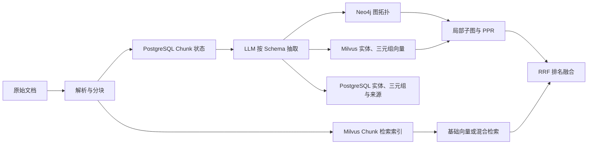

# 知识图谱开发与维护指南

本指南以“滨江科创中心一期工程”演示数据为例，说明如何在 Yuxi 当前的 Milvus + Neo4j 图增强 RAG 链路中，从零构建、验证、使用和维护知识图谱。适用对象为系统管理员、知识库维护者和参与图谱功能开发的工程师。

## 1. 先理解当前实现

### 1.1 当前链路不是 LightRAG

Yuxi 早期架构说明中可能仍出现 LightRAG，但当前 Milvus 知识库的图谱主链路由项目自研模块负责：



LightRAG 是一套相对完整的图增强 RAG 框架，通常自行组织文档状态、抽取、图存储、向量存储和查询模式。当前实现则把图谱能力直接嵌入 Yuxi 原有知识库生命周期，主要差异如下：

| 维度 | LightRAG 式集成 | 当前 Yuxi 实现 |
| --- | --- | --- |
| 管理边界 | 由独立框架管理索引生命周期 | 复用 Yuxi 的知识库、文件、Chunk、权限和模型配置 |
| 适用知识库 | 取决于框架适配器 | 当前只支持 `kb_type=milvus` |
| 图拓扑 | 由框架选择或适配图存储 | Neo4j 保存 Chunk、Entity 和关系拓扑 |
| 图谱事实与来源 | 依赖框架内部状态 | PostgreSQL 保存实体、三元组、mention 和 Chunk 抽取状态 |
| 图向量 | 由框架管理 | Milvus 独立保存实体、三元组向量 |
| 任务状态 | 框架任务或离线脚本 | API 进程内 `Tasker` 统一排队、进度和冲突检查 |
| 检索融合 | 框架预设查询模式 | 基础检索 + 实体/三元组召回 + 两跳子图 + PPR + 加权 RRF |
| 文件删除 | 取决于框架清理能力 | 按文件引用删除，清理无引用实体和三元组 |

这次重构的主要收益不是“换了两个数据库”，而是：

- 图谱与现有文件、Chunk、管理员权限、模型 Provider 和任务中心统一，不需要维护第二套知识库身份。
- 抽取配置随知识库保存；Chunk 通过 `graph_indexed` 和 `extraction_result` 支持待处理识别与增量构建。
- 相同实体和三元组使用稳定 ID 归一化，并保留到文件、Chunk 的来源引用，便于删除和追溯。
- 图谱实体、三元组也建立向量索引，问题不必精确命中实体名称。
- 图检索使用基础 Chunk、实体和三元组作为种子，经 Neo4j 局部扩散与 PPR 排序，再通过 RRF 与基础召回融合。
- Milvus 和 Neo4j 的同步 I/O 在查询路径中下沉到受限工作线程，减少阻塞 API 事件循环的风险。

### 1.2 三类存储各自负责什么

| 存储 | 核心职责 | 诊断时重点 |
| --- | --- | --- |
| PostgreSQL | 知识库配置、Chunk、`graph_indexed`、抽取结果、实体/三元组及文件/Chunk 来源 | 待处理数、失败 Chunk、来源引用是否存在 |
| Neo4j | Chunk 到 Entity 的 `MENTIONS`、Entity 到 Entity 的关系和局部子图 | 节点、边、知识库标签和文件引用是否正确 |
| Milvus | 普通知识 Chunk 向量，以及图实体、三元组向量 | Collection、向量维度、Embedding 模型和召回结果 |

三个存储共同组成一份可检索图谱，不能把 Neo4j 中“看得到节点”等同于整个构建链路已经完成。

## 2. 前置条件

开始前确认：

1. 当前不是 `LITE_MODE`。该模式会跳过知识库和 Neo4j 初始化，也不会注册相关路由。
2. API、PostgreSQL、Milvus、Etcd、Neo4j 和模型服务均可用。本地开发拓扑见[本地开发指南](/develop-guides/local-development)。
3. 使用管理员账号。构建、重置和图谱查询接口都要求管理员权限。
4. 已在“模型供应商”中配置一个支持非流式文本输出的聊天模型，以及知识库使用的 Embedding 模型。
5. 创建的是 Milvus 知识库。Dify 等其他知识库不会开放当前图谱构建接口。
6. 文档已经完成“上传 → 解析 → 入库”，知识库中存在 Chunk。图谱构建不会替代文档解析和普通向量入库。

开发环境至少检查 `MILVUS_URI`、可选的 `MILVUS_TOKEN`/`MILVUS_DB`，以及 `NEO4J_URI`、`NEO4J_USERNAME`、`NEO4J_PASSWORD` 是否由当前启动方式正确注入。敏感值只放在本地环境配置中，不要写入文档或测试。

## 3. 设计建筑领域 Schema

### 3.1 先从问题反推 Schema

先列出必须回答的问题，再决定实体和关系。例如：

- 谁开发、设计、施工和监理这个项目？
- 某栋楼采用哪些技术、材料和设备？
- 某次质量事件影响哪个单体，由谁整改？
- 某位负责人属于哪家单位、担任什么角色？

不要把日期、金额、面积和楼层数全部建成实体。它们更适合作为属性或保留在原始 Chunk 中；只有需要跨文档连接和遍历的概念才应成为节点。

### 3.2 可直接使用的 Schema

在图谱抽取配置的“Schema”文本框中粘贴以下内容：

```text
实体类型：
- Project：建设项目。
- Building：建筑单体或工程区域。
- Organization：建设、设计、施工、监理、供应单位。
- Person：项目相关人员。
- Role：人员在项目中的正式角色。
- Technology：工艺、平台或施工技术。
- Material：有明确名称或等级的建筑材料。
- Equipment：施工设备或机电设备。
- Contract：有名称或编号的合同。
- Event：质量、安全、进度或设计变更事件。

允许的关系及方向：
- DEVELOPS：Organization -> Project
- DESIGNS：Organization -> Project/Building
- CONSTRUCTS：Organization -> Project/Building
- SUPERVISES：Organization/Person -> Project
- SUPPLIES：Organization -> Material/Equipment
- WORKS_AT：Person -> Organization
- SERVES_AS：Person -> Role
- PARTICIPATES_IN：Person/Organization -> Project
- RESPONSIBLE_FOR：Person/Organization -> Building/Event
- USES：Project/Building -> Technology/Material/Equipment
- LOCATED_IN：Building -> Project
- GOVERNED_BY：Project/Organization -> Contract
- AFFECTS：Event -> Building/Project
- RECTIFIED_BY：Event -> Organization/Person

抽取规则：
1. 只使用上面的实体类型和关系类型。
2. 企业使用完整名称，人员使用完整姓名。
3. 同一材料保留完整强度等级，例如“HRB400E 钢筋”。
4. BIM 平台归为 Technology，具体设备归为 Equipment。
5. 日期、金额、面积、层数和地址不单独建实体。
6. 没有原文证据时不推测关系。
7. 严格保持关系方向，不生成同义反向关系。
```

建议先保持类型集合小而稳定。只有验证问题确实需要新类型时才扩展 Schema。

## 4. 准备演示数据

演示目录为：

`docs/public/examples/knowledge-graph-construction-demo/`

在已构建的文档站中也可直接下载：

- <a href="/examples/knowledge-graph-construction-demo/01-project-overview.md" download>01 项目概况</a>
- <a href="/examples/knowledge-graph-construction-demo/02-participants.md" download>02 参建方</a>
- <a href="/examples/knowledge-graph-construction-demo/03-buildings-and-technologies.md" download>03 单体与技术</a>
- <a href="/examples/knowledge-graph-construction-demo/04-contracts-and-suppliers.md" download>04 合同与供应商</a>
- <a href="/examples/knowledge-graph-construction-demo/05-quality-and-safety-events.md" download>05 质量安全事件</a>
- <a href="/examples/knowledge-graph-construction-demo/06-progress-and-changes.md" download>06 进度与变更</a>

人工验收基线：

- [标准实体 CSV](/examples/knowledge-graph-construction-demo/expected-entities.csv)
- [标准关系 CSV](/examples/knowledge-graph-construction-demo/expected-relations.csv)
- <a href="/examples/knowledge-graph-construction-demo/validation-questions.md" download>验证问题</a>

只把 `01` 至 `06` 上传到知识库。不要上传 README、CSV 和验证问题，否则答案会污染被测数据。

## 5. 通过界面完成第一次试建

### 第一步：创建 Milvus 知识库

1. 使用管理员账号进入“知识库”。
2. 新建知识库，类型选择 Milvus。
3. 选择可用的 Embedding 模型和合适的分块策略。
4. 建议命名为“建筑知识图谱演示”，便于与生产知识库区分。

Embedding 模型一旦用于普通 Chunk 和图实体/三元组向量，后续不要直接换成不同维度的模型。需要更换时应创建新知识库，或按第 10 节完整重建。

### 第二步：上传前三份试建文档

先上传：

1. `01-project-overview.md`
2. `02-participants.md`
3. `03-buildings-and-technologies.md`

在文件管理中确认三份文件均完成解析和入库。若仍显示待解析或待入库，先完成文档处理，不要进入图谱构建。

先试建三份的原因是：它们已经覆盖项目、建筑、组织、人员、角色、技术、材料和设备，可以低成本发现 Schema 太宽、实体命名不统一或关系方向错误。

### 第三步：锁定图谱抽取配置

1. 打开知识库详情的“知识图谱”页签。
2. 打开“索引管理”。
3. 选择当前唯一可用的 `LLM` 抽取器。
4. 选择聊天模型，粘贴第 3.2 节 Schema。
5. 首次建议并发数设置为 `2` 至 `5`，模型参数可先使用：

```json
{
  "temperature": 0
}
```

6. 保存配置。

保存后抽取器类型会锁定；模型、Schema、并发和模型参数仍可修改。修改配置只影响尚未抽取的 Chunk，已经保存 `extraction_result` 的 Chunk会复用原结果。需要全库使用同一配置时必须重置后重建。

### 第四步：开始构建

在“索引管理”中点击构建。默认每批读取 20 个待处理 Chunk，实际 LLM 并发由 `concurrency_count` 控制。

重点观察：

- `total_chunks`：知识库 Chunk 总数。
- `pending_chunks`：尚未完成图谱构建的 Chunk 数。
- `indexed_chunks`：已经完成图谱链路的 Chunk 数。
- `entity_count` / `relationship_count`：PostgreSQL 中当前图谱统计。
- `build_task_status` / `build_task_progress`：Tasker 中的任务状态和进度。

成功条件不是实体数量达到某个固定值，而是任务结束后 `pending_chunks=0`、失败数为 0，并且核心实体和关系有正确证据。

### 第五步：检查第一次结果

在图谱页签：

1. 先以 `*` 加载局部图。
2. 勾选“排除 Chunk 节点”，只观察业务实体。
3. 分别搜索“滨江科创中心一期工程”“研发办公楼”“林岚”。
4. 检查关系方向和实体类型。
5. 对照标准实体和关系 CSV 的 `01;02;03` 证据项。

重点检查：

- 项目与三栋建筑是否独立成节点。
- “华东新城建设集团有限公司”是否被完整抽取，而不是拆成简称。
- 林岚是否通过 `WORKS_AT` 和 `SERVES_AS` 连接到单位与角色。
- 研发办公楼与装配式施工、材料的 `USES` 关系方向是否正确。
- 图谱详情能否回溯到原始 Chunk。

发现类型混乱时，先重置这三份试建结果、收紧 Schema，再重新构建；不要直接上传全量数据掩盖问题。

## 6. 完成增量构建

第一次结果符合预期后，继续上传并完成解析、入库：

1. `04-contracts-and-suppliers.md`
2. `05-quality-and-safety-events.md`
3. `06-progress-and-changes.md`

新 Chunk 的 `graph_indexed` 初始为未完成，因此索引管理会显示新的 `pending_chunks`。再次点击构建只处理待处理 Chunk，不会重复调用已经保存结果的 Chunk。

增量完成后检查：

- 江州钢铁供应链有限公司到 HRB400E 钢筋的 `SUPPLIES`。
- 地下车库渗水整改事件到地下车库的 `AFFECTS`。
- 事件到华东新城建设集团有限公司的 `RECTIFIED_BY`。
- 实验楼暖通设计变更事件与实验楼、设计单位的关系。
- 同名核心实体是否合并，而不是因简称或空格形成重复节点。

## 7. 启用并验证图增强检索

图谱构建完成不代表问答会自动使用图谱。Milvus 知识库的 `use_graph_retrieval` 默认是关闭的。

进入知识库“检索配置”：

1. 开启“启用图检索”。
2. 初次使用默认参数：

| 参数 | 默认值 | 含义 |
| --- | ---: | --- |
| `graph_entity_top_k` | 10 | 通过问题向量召回的实体数 |
| `graph_triple_top_k` | 10 | 通过问题向量召回的三元组数 |
| `graph_max_nodes` | 10000 | 两跳扩散子图读取节点上限 |
| `graph_top_k` | 20 | PPR 后返回的图谱 Chunk 数 |
| `graph_weight` | 1.0 | RRF 中图检索结果权重 |
| `ppr_damping` | 0.85 | Personalized PageRank 阻尼系数 |

3. 保存配置。
4. 在“检索测试”中先关闭图检索记录基础结果，再开启图检索使用相同问题对照。

推荐优先测试：

- “地下车库渗水由谁组织整改，谁负责复验监督，他们分别属于什么单位？”
- “实验楼暖通设计变更涉及哪些设计、施工和供应单位？”
- “研发办公楼使用的主要结构材料由哪些单位供应？”

调参顺序：

1. 先看实体和三元组种子是否命中，不命中时适当增加两个 `top_k`。
2. 种子正确但缺少关联文档时，再调整 `graph_top_k` 或 `graph_max_nodes`。
3. 图结果正确但被基础召回压制时，小幅增加 `graph_weight`。
4. 最后才调整 `ppr_damping`，通常保留 `0.85` 即可。

无答案问题必须明确回答“文档未提供”。图扩散只能发现已有关系，不能作为推测事实的依据。

## 8. 管理 API 示例

以下 PowerShell 示例使用环境变量或当前会话变量，不写入真实凭据：

```powershell
$YUXI_API_BASE = "http://localhost:8002"
$YUXI_ADMIN_TOKEN = "<管理员 JWT 或 API Key>"
$YUXI_KB_ID = "<Milvus 知识库 ID>"
$YUXI_MODEL_SPEC = "<provider_id:model_id>"

$headers = @{
  Authorization = "Bearer $YUXI_ADMIN_TOKEN"
  "Content-Type" = "application/json"
}
```

### 8.1 查询构建状态

```powershell
Invoke-RestMethod `
  -Method Get `
  -Uri "$YUXI_API_BASE/api/knowledge/databases/$YUXI_KB_ID/graph-build/status" `
  -Headers $headers
```

### 8.2 保存或修改抽取配置

```powershell
$schema = @"
实体类型：Project, Building, Organization, Person, Role, Technology, Material, Equipment, Contract, Event。
关系类型及方向：DEVELOPS Organization->Project；DESIGNS Organization->Project/Building；
CONSTRUCTS Organization->Project/Building；SUPERVISES Organization/Person->Project；
SUPPLIES Organization->Material/Equipment；WORKS_AT Person->Organization；
SERVES_AS Person->Role；PARTICIPATES_IN Person/Organization->Project；
RESPONSIBLE_FOR Person/Organization->Building/Event；USES Project/Building->Technology/Material/Equipment；
LOCATED_IN Building->Project；GOVERNED_BY Project/Organization->Contract；
AFFECTS Event->Building/Project；RECTIFIED_BY Event->Organization/Person。
只抽取有原文证据的关系，保持完整名称和固定方向。
"@

$body = @{
  extractor_type = "llm"
  extractor_options = @{
    model_spec = $YUXI_MODEL_SPEC
    schema = $schema
    concurrency_count = 3
    model_params = @{ temperature = 0 }
  }
} | ConvertTo-Json -Depth 8

Invoke-RestMethod `
  -Method Post `
  -Uri "$YUXI_API_BASE/api/knowledge/databases/$YUXI_KB_ID/graph-build/config" `
  -Headers $headers `
  -Body $body
```

### 8.3 提交增量构建

```powershell
$body = @{ batch_size = 20 } | ConvertTo-Json

Invoke-RestMethod `
  -Method Post `
  -Uri "$YUXI_API_BASE/api/knowledge/databases/$YUXI_KB_ID/graph-build/index" `
  -Headers $headers `
  -Body $body
```

同一知识库同时只能存在一个活动构建任务。重复提交返回 `409`。`batch_size` 会被限制在 1 至 200；它控制数据库取数批次，不等同于 LLM 并发。

### 8.4 查询局部子图

```powershell
$query = [uri]::EscapeDataString("地下车库")

Invoke-RestMethod `
  -Method Get `
  -Uri "$YUXI_API_BASE/api/graph/subgraph?kb_id=$YUXI_KB_ID&node_label=$query&max_depth=2&max_nodes=100&exclude_chunk=true" `
  -Headers $headers
```

`max_depth` 接口允许 1 至 5，`max_nodes` 允许 1 至 1000。日常可视化建议保持深度 2，并限制节点数，避免图过密。

### 8.5 重置图谱

只重建图谱并保留抽取配置：

```powershell
$body = @{
  clear_extraction_result = $true
  clear_config = $false
} | ConvertTo-Json

Invoke-RestMethod `
  -Method Post `
  -Uri "$YUXI_API_BASE/api/knowledge/databases/$YUXI_KB_ID/graph-build/reset" `
  -Headers $headers `
  -Body $body
```

若 Schema 或抽取模型发生根本变化，把 `clear_config` 改为 `$true`，再重新保存配置。重置会删除该知识库的 Neo4j 图、PostgreSQL 图记录和 Milvus 图向量 Collection，并把 Chunk 标记为待构建；这是破坏性操作，执行前先确认知识库 ID，且不能在构建任务运行时执行。

## 9. 验收方法

### 9.1 数据完整性

- 6 份上传文件都完成解析和普通向量入库。
- `total_chunks > 0`。
- 构建结束后 `pending_chunks=0`，`indexed_chunks=total_chunks`。
- 核心 Project、Building、Organization、Event 能在图谱中找到。
- 核心关系能回溯到正确文件和 Chunk。

### 9.2 质量抽样

分别从标准实体、标准关系中抽样：

- 高频实体：项目、三栋单体、四个核心参建单位。
- 跨文件人员：林岚、陈启航、赵凯、孙若川。
- 供应链：供应商 → 材料/设备 → 使用单体。
- 事件链：事件 → 影响单体 → 整改单位/人员。

LLM 可能额外抽取合理实体，也可能漏掉次要关系。验收以“核心关系正确、命名稳定、有证据、无明显臆造”为准，不把 CSV 行数作为精确断言。

### 9.3 检索对照

对每个问题记录：

- 基础检索返回的 Chunk。
- 开启图检索后的 Chunk 和 `fusion_sources`。
- 最终回答引用的原始文档。
- 是否补齐了跨文档关系。
- 无答案问题是否拒绝推测。

## 10. 日常维护

### 10.1 增加文件

上传、解析和入库后，确认 `pending_chunks` 增加，再执行一次增量构建。无需重置已有图谱。

### 10.2 删除文件

通过知识库文件管理或正式 API 删除文件，不要直接删除 Neo4j 节点。Milvus 知识库删除文件时会同步清理：

- 普通知识 Chunk。
- PostgreSQL 中该文件的实体和三元组 mention。
- 失去全部引用的图实体、三元组向量。
- Neo4j 中该文件的 `MENTIONS`、关系和孤立节点。

共享实体若仍被其他文件引用应继续保留。

### 10.3 修改 Schema 或模型

配置更新只影响待处理 Chunk，已有 `extraction_result` 会被复用。因此：

- 仅新增文件：更新配置后直接增量构建。
- 需要全库统一新 Schema：重置且清空抽取结果，再全量构建。
- 更换聊天抽取模型：为保证结果一致，建议全量重建。
- 更换 Embedding 模型或向量维度：优先新建知识库重新入库；不要只重建 Neo4j。

### 10.4 版本化

生产数据建议把以下内容一起版本化：

- Schema 文本和版本号。
- `model_spec` 与关键 `model_params`。
- 分块策略与 Embedding 模型。
- 构建日期、文件清单、成功/失败 Chunk 数。
- 固定验证问题和人工评审记录。

当前配置内部会记录创建/更新人和时间，但没有独立的 Schema 版本管理功能，维护者应在项目文档或配置仓库中显式记录。

## 11. 常见问题排查

| 现象 | 优先检查 | 处理建议 |
| --- | --- | --- |
| 没有“知识图谱”页签 | 知识库类型、`LITE_MODE`、管理员权限 | 使用 Milvus 知识库并以完整模式启动 |
| `total_chunks=0` | 文档是否完成解析和入库 | 先完成普通知识库处理 |
| 配置接口报模型错误 | `model_spec`、Provider 状态 | 使用存在的 `provider_id:model_id` |
| 构建大量失败或被限流 | 任务详情、API 日志、模型配额 | 降低 `concurrency_count` 后重新构建待处理 Chunk |
| 重复提交返回 409 | 同知识库活动任务 | 等待、取消或处理现有任务 |
| 图谱有节点但 `pending_chunks>0` | Chunk 失败记录、API 日志 | 修复失败原因后再次执行增量构建 |
| 图谱可视化为空 | 搜索词、排除 Chunk、Neo4j 连接 | 先用 `*`、深度 2、节点 100 查询 |
| 图谱建成但问答没有变化 | `use_graph_retrieval` | 在检索配置中启用并保存 |
| 图检索总是返回基础结果 | Milvus 图 Collection、Embedding 模型、Neo4j 子图 | 分别检查实体/三元组召回和子图种子 |
| 删除文件后仍看到共享实体 | 是否仍有其他文件 mention | 共享实体保留是预期行为 |
| 修改 Schema 后旧结果不变 | 已有 `extraction_result` 被复用 | 清空抽取结果并全量重建 |
| API 重启后任务中断 | Tasker 在 API 进程内执行 | 构建期间保持 API 稳定，重启后检查待处理 Chunk 再重提 |
| 三个存储数量不一致 | 写入顺序、错误日志、Chunk 状态 | 停止继续构建，定位失败环节；确认后使用正式 reset 重建 |

构建单个 Chunk 时会依次写 Neo4j、PostgreSQL 图记录、Milvus 图向量，最后标记 `graph_indexed`。这些系统没有分布式事务；中途错误可能留下部分写入。不要通过手工补节点或把 Chunk 强制标记为成功来掩盖问题，应先查看错误，再使用重置链路恢复一致性。

## 12. 开发代码地图

| 关注点 | 代码入口 |
| --- | --- |
| 构建状态、配置、索引、重置 API | `backend/server/routers/knowledge_router.py` |
| 图谱列表、子图、标签、统计 API | `backend/server/routers/graph_router.py` |
| 构建、Neo4j 写入、删除、PPR | `backend/package/yuxi/knowledge/graphs/milvus_graph_service.py` |
| LLM 抽取器与 Schema Prompt | `backend/package/yuxi/knowledge/graphs/extractors/llm.py` |
| 抽取结果归一化 | `backend/package/yuxi/knowledge/graphs/extractors/base.py` |
| 图实体/三元组 Milvus 向量 | `backend/package/yuxi/knowledge/graphs/milvus_graph_vector_store.py` |
| 图载荷和稳定 ID | `backend/package/yuxi/knowledge/graphs/graph_utils.py` |
| 图谱 PostgreSQL 仓储 | `backend/package/yuxi/repositories/knowledge_graph_repository.py` |
| Chunk 图状态仓储 | `backend/package/yuxi/repositories/knowledge_chunk_repository.py` |
| 图增强检索和 RRF | `backend/package/yuxi/knowledge/implementations/milvus.py` |
| Neo4j 连接和安全标签 | `backend/package/yuxi/storage/neo4j/manager.py` |
| 前端图谱构建与可视化 | `web/src/components/KnowledgeGraphSection.vue` |
| 前端构建 API | `web/src/apis/knowledge_api.js` |
| 前端子图 API | `web/src/apis/graph_api.js` |

新增能力时保持边界清晰：路由只负责权限和请求适配，流程进入 `MilvusGraphService`，持久化进入 repository 或对应存储适配器。

## 13. 测试建议

遵循[测试规范](/develop-guides/testing-guidelines)，根据改动范围选择：

- 抽取结果、ID、PPR、删除或构建流程：扩展 `backend/test/unit/graphs/test_milvus_graph_build.py`。
- 检索参数与排名：扩展 `backend/test/unit/knowledge/test_milvus_retrieval_config.py`。
- 图谱路由权限和非 Milvus 拒绝行为：扩展 `backend/test/integration/api/test_unified_graph_router.py`。
- 修改真实构建主链路：在可控测试基础设施中增加 Milvus + Neo4j + PostgreSQL 集成验证。
- 修改前端：至少验证配置保存、任务状态轮询、重置确认、子图查询和错误提示。

不要只断言“函数被调用”。有价值的测试应验证稳定 ID、来源引用、待处理状态、删除后共享实体保留，以及检索排名等真实行为。

## 14. 当前限制

- 只有 Milvus 知识库支持这套图谱 API。
- 当前仅有 LLM 抽取器，结果受模型能力、分块和温度影响，不完全确定。
- 抽取配置没有独立 Schema 版本和自动迁移；已有抽取结果不会因配置更新自动失效。
- 图检索从实体、三元组和基础 Chunk 生成种子，使用两跳局部子图；它不是任意深度的全图推理。
- PostgreSQL、Neo4j、Milvus 之间没有分布式事务，异常时需要根据 Chunk 状态和日志恢复。
- 图谱构建任务运行在 API 进程内，不适合在任务期间重启 API。
- 图检索默认关闭，建图后仍需在检索配置中显式启用。
- 检索路径遇到图谱异常时会记录错误并保留基础检索结果，因此回答正常不代表图检索链路一定正常；验证时应检查日志和 `fusion_sources`。

完成演示后，建议保留知识库、Schema、验证记录一段时间，作为后续模型、分块或检索参数变更的回归基线。
