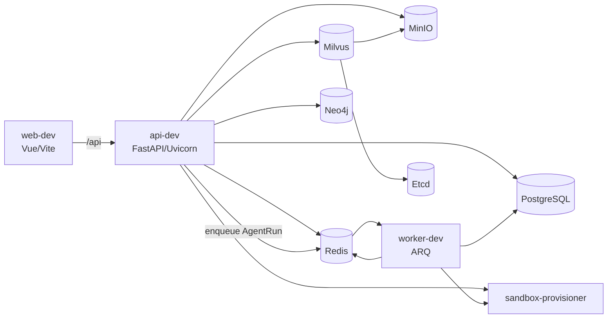
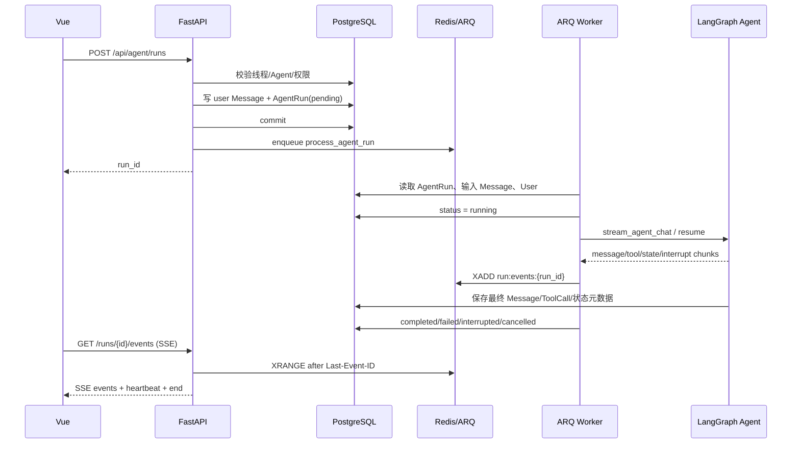
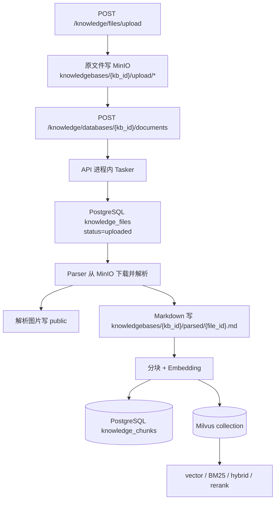

# 📊 项目分析报告

生成时间：2026-07-14 15:53:35 +08:00

分析范围：`backend` 后端模块及其直接运行依赖（`docker-compose.yml`、`docker/api.Dockerfile`、根目录 `README.md`、测试目录）。

代码基线：`629e83b45f14860b111efa2ba8f2de6b9dcd299b`

验证边界：本报告基于当前仓库源码、依赖锁定、Compose 配置和测试结构完成静态追踪。当前工作环境没有 `.env`，且无法找到 Docker/uv 命令，因此没有执行容器健康检查、日志检查或真实接口测试；涉及“实际运行状态”的内容均以代码路径为依据，不假装已经做过在线验证。

## 🧱 技术栈

### 1. 总体结论

当前后端不是 LightRAG 应用，也不是由多个独立业务微服务组成的系统。更准确的定义是：

> 一个以 FastAPI 为 HTTP 入口、以 `yuxi` Python 包承载领域逻辑的模块化单体，旁挂一个共享相同代码和数据库的 ARQ Agent worker，并依赖 PostgreSQL、Redis、MinIO、Milvus、Neo4j、Etcd 与沙盒服务。

根目录 `AGENTS.md` 和 `backend/pyproject.toml` 的描述仍包含 “LightRAG”，但当前依赖中没有 LightRAG 包，工厂也不再注册 LightRAG 知识库。`README.md:94-100` 和 `docs/develop-guides/changelog.md:97-114` 明确说明历史 LightRAG 已被自研 Milvus/Neo4j 链路替代。

### 2. 核心技术与实际用途

| 层次 | 技术 | 当前代码中的用途 | 主要依据 |
| --- | --- | --- | --- |
| 语言/运行时 | Python 3.12-3.13 | API、worker、知识库、Agent、脚本与测试 | `backend/pyproject.toml:6`、`docker/api.Dockerfile:1-3` |
| 依赖/构建 | uv、setuptools | 工作区依赖管理；`yuxi` 以 editable 本地包安装 | `backend/pyproject.toml:22-49`、`backend/package/pyproject.toml:1-10` |
| Web | FastAPI、Uvicorn、Pydantic | HTTP 路由、依赖注入、生命周期、SSE | `backend/server/main.py:18-24,75-83` |
| ORM/数据库 | SQLAlchemy 2 async、asyncpg | PostgreSQL 业务表和知识库元数据读写 | `backend/package/yuxi/storage/postgres/manager.py:7-10,55-71` |
| PostgreSQL 原生连接 | psycopg 3 + psycopg_pool | 可选的 LangGraph PostgreSQL checkpointer | `backend/package/yuxi/storage/postgres/manager.py:74-86` |
| Agent | LangChain 1.x、LangGraph 1.x、DeepAgents | Agent graph、工具调用、状态、checkpoint、中间件、文件后端 | `backend/package/pyproject.toml:22,28-40`、`agents/buildin/chatbot/graph.py:1-3,93-102` |
| 异步运行 | ARQ、Redis | Agent run 队列、运行事件流、取消信号 | `agent_run_service.py:682-685`、`run_queue_service.py:14-27,155-180` |
| 应用内任务 | asyncio.Queue | 知识库解析、入库和图谱构建任务；默认两个协程 worker | `task_service.py:102-123,136-150,424` |
| 对象存储 | MinIO Python SDK | 知识库原文件/解析 Markdown/图片、临时附件、头像等 | `storage/minio/client.py:45-58,109-145` |
| 向量检索 | Milvus 2.5 / pymilvus | Dense、BM25、加权混合召回，存 chunk 向量 | `docker-compose.yml:274-301`、`knowledge/implementations/milvus.py:399-439,889-1066` |
| 图数据库 | Neo4j 5.26 | 知识图谱节点、关系与子图/PPR 查询 | `docker-compose.yml:205-228`、`storage/neo4j/manager.py:37-62` |
| 图谱向量 | Milvus | 实体和三元组向量检索，作为图检索种子 | `knowledge/graphs/milvus_graph_vector_store.py`、`knowledge/implementations/milvus.py:1086-1138` |
| Milvus 元数据 | Etcd | Milvus standalone 的元数据协调 | `docker-compose.yml:230-249,280-282` |
| 文档解析 | RapidOCR、MinerU、PaddleOCR、PP-Structure、DeepSeek OCR | 统一 Parser 后端，可选本地或 HTTP/云端解析 | `knowledge/parser/factory.py:17-26` |
| 模型适配 | LangChain provider adapters | chat/embedding/rerank 三类模型，配置来自 PostgreSQL、缓存到 Redis | `models/providers/service.py:21`、`models/providers/cache.py:3-6,134-172` |
| 可观测性 | Langfuse、LangSmith、Loguru | Agent trace、回调与结构化日志 | `backend/package/pyproject.toml:36,41,44`、`services/langfuse_service.py` |
| 工具扩展 | MCP、Skills、内置 Tools、SubAgents | 按 Agent context 和权限动态组装工具 | `agents/toolkits/service.py:97-144`、`agents/middlewares/skills.py` |
| 沙盒 | agent-sandbox + sandbox-provisioner | Agent 文件系统、命令/工具执行、产物生成 | `agents/backends/composite.py:163-200`、`docker-compose.yml:125-176` |
| 测试/Lint | pytest、pytest-asyncio、pytest-httpx、Ruff | unit/integration/e2e 分层；Ruff 格式与检查 | `backend/pyproject.toml:52-76` |

### 3. RAG 技术细节

当前 RAG 主链路是自研的 Milvus 知识库：

1. 文档被解析为 Markdown。
2. 使用 RAGFlow-like 分块策略生成 chunk。
3. 调用配置的 embedding 模型生成向量。
4. chunk 文本和位置元数据写 PostgreSQL，文本/标识/稠密向量写 Milvus。
5. Milvus collection 同时配置稀疏字段和 BM25 Function，支持 `vector`、`keyword`、`hybrid` 三种模式。
6. 混合检索使用 `WeightedRanker(vector_weight, bm25_weight)`；可选再经过 reranker。
7. 开启图检索后，会结合 Milvus 的实体/三元组向量召回与 Neo4j 图排序结果。

证据：`knowledge/implementations/milvus.py:504-601,647-758,889-1138`。

## 🗂️ 项目结构

### 1. 后端两层边界

```text
backend/
├── server/                 # FastAPI/HTTP 适配层与进程入口
│   ├── main.py             # API 入口、中间件、/api 总路由
│   ├── worker_main.py      # ARQ worker 导出入口
│   ├── routers/            # HTTP 路由、请求模型、认证依赖装配
│   └── utils/              # lifespan、认证、日志、中间件
├── package/yuxi/           # 可复用的核心业务包
│   ├── agents/             # Agent、Context、中间件、Tools、Skills、MCP、Sandbox
│   ├── services/           # 用例编排层
│   ├── repositories/       # PostgreSQL 查询/持久化边界
│   ├── storage/            # PostgreSQL、Redis、MinIO、Neo4j 基础设施
│   ├── knowledge/          # 知识库、解析、分块、Milvus、图谱、评估
│   ├── models/             # chat/embedding/rerank 模型适配与 provider 缓存
│   ├── config/             # 系统配置、运行时 Redis 同步
│   └── utils/              # 日志、鉴权、路径、哈希等通用能力
├── scripts/                # 初始化/维护脚本
├── test/                   # unit / integration / e2e
├── pyproject.toml          # API 工作区依赖、pytest/Ruff 配置
└── package/pyproject.toml  # yuxi 核心包完整依赖
```

### 2. 规模与阅读优先级

当前主要 Python 代码规模约为：

| 区域 | Python 文件数 | 约代码行数 |
| --- | ---: | ---: |
| `backend/server/routers` | 20 | 8,006 |
| `backend/package/yuxi/services` | 21 | 8,978 |
| `backend/package/yuxi/repositories` | 14 | 3,024 |
| `backend/package/yuxi/agents` | 53 | 10,372 |
| `backend/package/yuxi/knowledge` | 55 | 14,481 |
| `backend/test/unit` | 104 | 24,208 |
| `backend/test/integration` | 21 | 3,783 |
| `backend/test/e2e` | 7 | 1,612 |

因此不适合从头逐文件阅读。应先按“一条纵向业务链”阅读，再扩展横向模块。

### 3. HTTP 路由分组

所有路由统一挂在 `/api`。`backend/server/routers/__init__.py:24-55` 注册：

- 基础：`/system`、`/auth`、`/agent`、`/agent-invocation`、`/chat`。
- 管理：`/dashboard`、`/departments`、`/tasks`、`/system/mcp-servers`、`/system/model-providers`、`/system/skills`、`/system/tools`。
- 用户与文件：`/user`、`/viewer/filesystem`、`/workspace`、`/mention`。
- 非 LITE：`/knowledge`、`/evaluation`、`/graph`。

路由层的设计意图是“薄适配层”，复杂流程通常委托给 `services`；但 `knowledge_router.py` 当前仍包含大量任务编排逻辑，是一个明显例外。

## 🧩 功能模块

### 1. API 生命周期

`backend/server/main.py` 创建 FastAPI 应用，配置：

- `/api` 路由前缀。
- 开发环境 CORS。
- 登录接口的进程内 IP 限流。
- 访问日志中间件。
- `lifespan` 启停流程。

`backend/server/utils/lifespan.py:19-123` 启动顺序为：

1. 初始化 PostgreSQL、创建业务/知识库表、执行 schema 补丁。
2. 初始化内置 MCP、Skills、默认 Agent、模型供应商。
3. 重建模型缓存。
4. 非 LITE 模式初始化知识库管理器。
5. 预热 Redis。
6. 启动 Redis 运行时配置同步。
7. 初始化 sandbox provider。
8. 调用 `AsyncPostgresSaver.setup()` 创建 LangGraph checkpoint 表。
9. 启动 API 进程内 `Tasker`。

停止时关闭 Tasker、sandbox、Redis 和 PostgreSQL。

### 2. Agent 系统

Agent 不是把所有逻辑写在一个 prompt 里，而是按以下组件组装：

- `BaseAgent`：统一 checkpoint、历史状态和基础接口。
- `ChatbotAgent` / `SubagentAgent`：内置 LangGraph graph。
- `BaseContext`：模型、工具、知识库、MCP、Skills、SubAgents、摘要阈值等运行配置。
- middleware：文件系统、附件落盘、Skills、SubAgent task、上下文摘要、Todo、工具调用修复、模型重试、Token 统计。
- toolkits：内置工具、知识库工具、调试工具及注册表。
- backends：沙盒文件系统与只读 Skills 路径的组合后端。

`ChatbotAgent.get_graph()` 最终调用 LangChain `create_agent()`，注入模型、工具、系统提示词、中间件、State schema 和 checkpointer，见 `agents/buildin/chatbot/graph.py:86-104`。

知识库工具不是始终暴露给模型。内置 `knowledge-base` Skill 声明 `list_kbs/query_kb/open/find/get_mindmap/search_file` 为依赖；工具先注册到 ToolNode，再由 `SkillsMiddleware` 按激活状态控制模型可见性。见 `agents/skills/buildin/__init__.py:35-47` 和 `agents/middlewares/skills.py:149-164,219-260`。

### 3. 知识库系统

当前工厂注册的类型：

- `milvus`：完整的上传、解析、分块、向量入库、检索和图谱能力。
- `dify`：Dify Dataset Retrieve API 只读连接器。
- `notion`：Notion Data Source 只读连接器。

证据：`knowledge/__init__.py:13-18`。LITE 模式不注册 Milvus，但仍注册 Dify 和 Notion。

`KnowledgeBaseManager` 负责按 `kb_type` 找到/缓存实现；数据库和文件元数据的事实来源是 PostgreSQL，不再维护完整的文件元数据内存副本，见 `knowledge/manager.py:16-43`、`knowledge/base.py:119-129`。

Milvus 文件入库会同时写两个存储：

- PostgreSQL `knowledge_chunks`：保留 chunk 文本、位置、图谱抽取状态，方便元数据查询、全文打开和图谱处理。
- Milvus collection：保留检索字段、稠密向量和 BM25 稀疏字段。

写入失败时代码会尝试补偿删除两侧记录，但这不是数据库级分布式事务，见 `knowledge/implementations/milvus.py:534-574`。

### 4. 知识图谱

当前图谱不是 LightRAG 图谱：

1. 从 PostgreSQL `knowledge_chunks` 取尚未图谱化的 chunk。
2. `GraphExtractor`（当前主要为 LLM extractor）抽取实体和关系。
3. 抽取结果回写 chunk。
4. 结构化实体、三元组和 mention 写 PostgreSQL。
5. 图节点与边写 Neo4j。
6. 实体/三元组向量写 Milvus 图谱 collection。
7. 查询时可用 Neo4j 子图/PPR 和 Milvus 图谱向量召回增强普通 chunk 召回。

证据：`knowledge/graphs/milvus_graph_service.py:77-240,317-451`、`knowledge/implementations/milvus.py:1086-1138`。

### 5. 文档解析

统一入口是 `knowledge/parser/unified.py` 的 `Parser`。处理器工厂支持：

- 本地 RapidOCR。
- 自建 MinerU HTTP 服务。
- MinerU 官方 API。
- PP-Structure V3。
- DeepSeek OCR。
- PaddleOCR VL / PP-OCRv6 云端 API。

Office、PDF、图片和 ZIP 会根据类型进入不同解析路径；解析产生的图片写 MinIO `public`，Markdown 写 `knowledgebases`。

### 6. 认证、权限与多租户

- JWT 和 `yxkey_` API Key 两套 Bearer 认证。
- 用户必须绑定部门。
- 角色包括普通用户、管理员、超级管理员。
- Agent、知识库、Skills 通过 `global/department/user` 共享范围控制可见性。
- 对话、run、文件和工作区均使用 uid/thread_id 做隔离。

证据：`server/utils/auth_middleware.py:17-140`、各 repository 的 `list_visible`/权限函数。

## 🔄 核心流程

### 1. Docker Compose 启动模式

开发模式主要进程：



- API 命令：`uvicorn server.main:app ... --reload`。
- Worker 命令：`watchfiles ... arq server.worker_main.WorkerSettings`。
- `server/worker_main.py` 只导出 `yuxi.services.run_worker.WorkerSettings`。
- API 与 worker 挂载相同的 `backend/server`、`backend/package` 和 `saves`，共享数据库，不是两个独立领域服务。

`make up-lite` 设置 `LITE_MODE=true` 和 `VITE_USE_RUNS_API=false`，显式启动 PostgreSQL、Redis、MinIO、API、Web；由于 API 依赖 sandbox-provisioner，Compose 仍会拉起沙盒依赖。它不启动 Milvus、Etcd、Neo4j 和 ARQ worker，且后端不注册知识库/图谱/评估路由。

### 2. Agent 异步主链路



关键设计点：

- 输入消息在入队前落 PostgreSQL，避免队列消费时丢失请求正文。
- commit 后才 enqueue，见 `agent_run_service.py:409-431`。
- `request_id` 支持幂等；同一用户、Agent、线程只允许一个活跃 run。
- Redis Stream 默认保留 7,200 秒；取消 key 默认 1,800 秒。
- SSE 支持 `Last-Event-ID` 断线续读。
- Agent worker 最多重试两次、单任务超时 3,600 秒，见 `run_worker.py:565-576`。
- 用户问答或人工审批会把 run 标记为 `interrupted`，后续创建 `resume` run。

### 3. 简单模型调用

`POST /api/chat/call` 是完全不同的轻路径：选择模型后直接 `ainvoke`，只返回响应和 request_id，不创建 Conversation/Message/AgentRun，不经过 ARQ、Skills、MCP、知识库或 LangGraph。见 `chat_router.py:61-75`。

### 4. 知识库上传、解析与入库



`auto_index=false` 时流程停在 parsed；之后可单独调用 index 接口。任务状态写 PostgreSQL `tasks`，但 coroutine 本身只存在 API 内存队列中。

### 5. PostgreSQL 到底用在哪里

PostgreSQL 是主业务数据库，不是可有可无的依赖。

#### 业务数据

- 组织与身份：`departments`、`users`、`agent_envs`、`user_config`。
- Agent 配置：`agents`、`skills`、`mcp_servers`、`model_providers`。
- 对话：`conversations`、`messages`、`tool_calls`、`message_feedbacks`、`conversation_stats`。
- 运行：`agent_runs`、`subagent_threads`、`tasks`。
- 安全与运维：`api_keys`、`cli_auth_sessions`、`operation_logs`。

定义位于 `storage/postgres/models_business.py`。

#### 知识库数据

- 元数据：`knowledge_bases`、`knowledge_files`。
- chunk 原文与位置：`knowledge_chunks`。
- 图谱镜像/索引元数据：entity、triple、mention 四类表。
- 评估：dataset、dataset item、run、run item。

定义位于 `storage/postgres/models_knowledge.py`。

#### 数据库访问方式

- 普通业务：`postgresql+asyncpg://` + SQLAlchemy async session。
- LangGraph Postgres checkpointer：去掉 `+asyncpg` 后使用 psycopg pool。
- FastAPI 的绝大多数认证路由都通过 `get_db()` 取得 PostgreSQL session；没有 PostgreSQL，登录、用户、Agent、Conversation、知识库和运行管理都无法正常工作。

#### Checkpoint 的重要例外

当前 `BaseAgent._get_checkpointer()` 默认读取：

```python
backend = os.getenv("LANGGRAPH_CHECKPOINTER_BACKEND", "sqlite")
```

因此默认 Agent 状态实际写 `saves/agents/<module>/aio_history.db`。只有显式设置 `LANGGRAPH_CHECKPOINTER_BACKEND=postgres` 才使用 PostgreSQL checkpointer。Compose 当前没有设置这个变量。

同时，FastAPI lifespan 又无条件执行 `AsyncPostgresSaver(pg_manager.langgraph_pool).setup()`。也就是说，当前代码会创建 PostgreSQL checkpoint 表，但默认 Agent graph 未必使用它。这是配置与生命周期不一致，不应简单描述成“系统默认用 PostgreSQL 保存 LangGraph checkpoint”。

### 6. MinIO 到底用在哪里

MinIO 同时承担“应用对象存储”和“Milvus 内部对象存储”两种职责。

#### Yuxi 代码直接使用

| Bucket | 对象 | 典型 key |
| --- | --- | --- |
| `knowledgebases` | 知识库原文件 | `{kb_id}/upload/{filename}` |
| `knowledgebases` | 解析后的 Markdown/PDF 预览 | `{kb_id}/parsed/{file_id}.md`、`{kb_id}/preview/{doc_id}.pdf` |
| `knowledgebases` | 对话临时附件 | 用户隔离的 tmp/original/parsed key |
| `public` | 解析产生的图片、头像等公开资源 | `{kb_id}/kb-images/*` 或业务生成路径 |

`MinIOClient.KB_BUCKETS` 把 documents/parsed 都映射到 `knowledgebases`，images 映射到 `public`，见 `storage/minio/client.py:45-52`。

PostgreSQL `knowledge_files` 不存文件二进制，只存 `path`、`minio_url`、`markdown_file`、hash、size、status 等元数据。对话附件还会在确认后物化到共享 `saves`/沙盒线程目录，PostgreSQL 保存附件元信息，因此 MinIO 与本地文件系统在附件链路中并存。

#### Milvus 间接使用

Compose 将 `MINIO_ADDRESS=minio:9000` 传给 Milvus。Milvus 把向量 segment、索引等内部对象写 MinIO，并用 Etcd 管理元数据。即使删掉 Yuxi 的 `MinIOClient` 直接调用，Milvus standalone 仍依赖 MinIO。见 `docker-compose.yml:274-299`。

#### 为什么容易“看不见”

- FastAPI 路由不会直接出现 SQL，数据库逻辑被 repository/manager 隔离。
- MinIO 客户端集中在 `storage/minio`，知识库通过 URL 和 helper 间接使用。
- Milvus 对 MinIO 的使用发生在容器内部，不在 Python 代码里。
- 一部分附件最终还会落本地 `saves`/沙盒目录，看上去像“只用了本地文件”。

### 7. 各存储的职责边界

| 存储 | 它保存什么 | 是否事实来源 |
| --- | --- | --- |
| PostgreSQL | 用户、权限、Agent、模型配置、会话、消息、运行、任务、知识库/文件/chunk/图谱/评估元数据 | 业务与元数据主事实来源 |
| Redis | ARQ 队列、Agent 临时事件流、取消信号、运行时配置快照、模型/mention 缓存 | 短期运行态，不是最终业务事实来源 |
| MinIO | 原始二进制、解析 Markdown、图片、临时附件；另供 Milvus 存 segment/index | 对象内容来源 |
| Milvus | chunk 向量、BM25 稀疏索引、实体/三元组向量 | 检索索引，可由源数据重建但成本高 |
| Neo4j | 知识图谱节点、边、子图关系 | 图查询来源；PostgreSQL还保留结构化镜像/mention |
| Etcd | Milvus 内部元数据 | Milvus 内部依赖 |
| `saves` | base.toml、Skills、线程文件/产物、沙盒工作区、默认 SQLite checkpoint | 文件/运行配置与默认 checkpoint |

## 🧠 架构设计

### 1. 架构类型

这是“模块化单体 + 后台 worker + 基础设施服务”，不是纯 MVC，也不是按业务拆分的微服务。

- `server/routers` 类似 Controller/Adapter。
- `services` 是应用用例层。
- `repositories` 是持久化端口。
- `storage` 是基础设施实现。
- `agents` 和 `knowledge` 是两个最大的领域子系统。
- API 与 ARQ worker 复用同一 `yuxi` 包、同一 PostgreSQL、Redis 和文件卷。

### 2. 关键架构模式

- Repository：数据库查询集中在 repositories。
- Factory/Strategy：知识库类型、文档解析器、图谱抽取器、模型 provider。
- Middleware pipeline：Agent 能力通过中间件组合。
- Event stream：Worker 将运行事件写 Redis Stream，API 转 SSE。
- Durable command record：AgentRun 先落 PostgreSQL，再入队。
- Compensating transaction：PostgreSQL + Milvus 双写失败后尝试清理两侧。
- Runtime context：Agent 配置按数据库配置、用户权限和单次模型覆盖合并。

### 3. LITE 模式边界

LITE 模式跳过：

- Milvus 知识库注册和初始化。
- `/knowledge`、`/evaluation`、`/graph` 路由。
- Neo4j 连接。
- Compose 中的 Milvus、Etcd、Neo4j、文档解析扩展服务和 ARQ worker（按 `make up-lite` 命令）。

LITE 仍需要 PostgreSQL、Redis、MinIO、API、Web 和 API 的沙盒依赖，因为用户、配置、简单问答、文件/头像/附件等基础能力仍使用它们。

### 4. 配置来源

配置有三层：

1. Compose + `.env`：数据库、Redis、MinIO、Milvus、Neo4j、模型 API 密钥、沙盒地址。
2. `saves/config/base.toml`：管理员修改后的应用配置。
3. Redis `yuxi:runtime_config`：在 API/worker 之间同步运行时配置快照。

模型 provider 本身保存在 PostgreSQL，重建后写 Redis `yuxi:model_cache`，Agent 使用 `provider_id:model_id` 格式选择 chat/embedding/rerank 模型。

## 🌐 外部依赖

### 1. 必需基础设施

- PostgreSQL 16：业务和知识库主数据库。
- Redis 7：ARQ、事件、取消和缓存。
- MinIO：Yuxi 文件对象 + Milvus 对象后端。
- sandbox-provisioner：Agent 文件/工具执行环境。

完整模式额外依赖：

- Milvus 2.5.6 + Etcd。
- Neo4j 5.26。

### 2. 可选外部能力

- OpenAI-compatible、Anthropic、Gemini、OpenRouter 等聊天模型接口。
- Embedding/Rerank 模型接口（如 SiliconFlow、DashScope）。
- Tavily 搜索。
- Langfuse/可能的 LangSmith 观测。
- Dify Dataset Retrieve API。
- Notion API。
- MinerU 本地服务或官方 API。
- PaddleOCR、DeepSeek OCR 等云端解析。
- 外部 MCP Server。
- Docker/Kubernetes 沙盒后端（由 provisioner 选择）。

### 3. 数据卷

- `docker/volumes/postgresql`：PostgreSQL。
- `docker/volumes/redis`：Redis AOF 数据。
- `docker/volumes/milvus/minio`：MinIO 对象。
- `docker/volumes/milvus/milvus`：Milvus 本地数据。
- `docker/volumes/neo4j`：Neo4j 数据和日志。
- `docker/volumes/yuxi` -> `/app/saves`：Yuxi 配置、线程文件、技能和 Agent 本地状态。

## ⚠️ 风险与技术债

### 1. LangGraph checkpoint 默认值与启动逻辑冲突（高）

问题：

- `BaseAgent` 默认使用 SQLite。
- Compose 没有设置 `LANGGRAPH_CHECKPOINTER_BACKEND`。
- FastAPI 启动却无条件依赖 PostgreSQL pool 执行 `AsyncPostgresSaver.setup()`。
- `PostgresManager.initialize()` 捕获异常声称允许应用继续启动，但后续无保护的 `AsyncPostgresSaver(pg_manager.langgraph_pool).setup()` 仍可能让启动失败。

影响：开发者会误判状态存储位置；API/worker 共享 SQLite 文件还可能带来多进程并发与锁竞争；同时维护两套 checkpoint 路径增加排障成本。

建议：明确唯一默认策略。生产/Compose 建议显式使用 PostgreSQL，并让 API、worker 共同校验；若保留 SQLite，仅用于单进程本地开发，并跳过无用的 PostgreSQL checkpointer setup。

### 2. 知识库 Tasker 不具备可恢复性和横向扩展能力（高）

问题：知识库任务 coroutine 位于 API 进程内 `asyncio.Queue`。任务记录虽写 PostgreSQL，但服务重启时只能把 pending/running 标成 failed，不能恢复；多个 API 实例也无法共享队列。

影响：大文件解析、批量 embedding、图谱构建中途重启会丢失执行上下文；扩容 API 时任务归属不透明。

建议：如果二开目标包含生产级批量入库，优先把知识任务迁到现有 ARQ worker 或独立 durable worker；保持 TaskRecord 为状态投影，而不是把内存队列当可靠队列。

### 3. Schema 迁移方式脆弱（高）

问题：启动时同时使用 `metadata.create_all()` 和 `manager.py` 中大段手写 `ALTER/CREATE/DROP` SQL，没有 Alembic 版本链。`ensure_business_schema`/`ensure_knowledge_schema` 还包含数据清理和索引修复。

影响：升级路径不可审计，失败后难以判断执行到哪一步，生产多实例同时启动时会增加 DDL 竞争风险。

建议：引入版本化迁移工具，将 schema 与数据迁移拆为幂等版本；应用启动只检查版本，不执行长期演进逻辑。

### 4. 知识库初始化不是强一致 readiness（中高）

问题：`KnowledgeBaseManager.initialize()` 调用 `_initialize_existing_kbs()`，后者在已有 event loop 下 `create_task()` 后立即返回。API 会继续打印启动完成，而已有 Milvus KB 的 metadata/connection 可能仍在后台加载。

同时 API Compose 只显式等待 PostgreSQL、Redis、MinIO、sandbox 健康，不等待 Milvus 或 Neo4j 健康。

影响：冷启动后首个知识库请求可能遇到初始化竞态或 Milvus 尚未就绪。

建议：把关键初始化纳入可等待的 readiness；非关键连接保持懒加载，但健康接口应区分 API alive 与完整依赖 ready。

### 5. MinIO 默认安全配置不适合公网生产（高）

问题：默认凭证为 `minioadmin/minioadmin`；客户端固定 `secure=False`；`public` bucket 被设置公开读；返回 URL 使用 `http://{HOST_IP}:9000/...`，未走应用鉴权。

影响：未正确覆盖环境变量时会有对象泄露和弱口令风险；`HOST_IP` 缺失时返回 localhost URL，远程用户无法访问。

建议：生产强制非默认密钥、TLS/反向代理、私有 bucket + 短时签名 URL；仅对明确公开的派生图片开放读取。

### 6. PostgreSQL + Milvus + Neo4j 多存储一致性依赖补偿逻辑（中高）

问题：chunk 同时写 PostgreSQL/Milvus；图谱同时写 PostgreSQL/Neo4j/Milvus。代码有补偿删除，但不存在跨存储原子事务。

影响：进程中断、网络分区或补偿失败可能产生孤儿 chunk、图节点或索引。

建议：为入库和图谱构建增加可重放的阶段状态、幂等键和定期一致性校验/修复任务；不要用静默 fallback 掩盖不一致。

### 7. Milvus 数据库环境变量命名漂移（中）

问题：Compose 注入 `MILVUS_DB_NAME`，MilvusKB 实现却默认硬编码 `yuxi`，图谱向量存储读取 `MILVUS_DB`。仓库内没有看到 Python 代码读取 `MILVUS_DB_NAME`。

影响：运维修改 `MILVUS_DB_NAME` 可能不会改变应用实际连接数据库，普通 chunk 和图谱向量还可能配置到不同 DB。

建议：统一为一个变量并由共享配置函数读取，补单元测试验证 Compose 名称与代码一致。

### 8. 大文件职责过重（中）

代表文件：

- `knowledge_router.py` 约 1,700+ 行，混合路由、上传、任务编排、清理和响应组装。
- `knowledge/base.py` 约 1,300+ 行。
- `chat_service.py` 约 1,200+ 行。
- `storage/postgres/manager.py` 约 750+ 行，并承担连接、建表和迁移。

影响：修改局部功能时认知范围大，容易误伤。

建议：只在实际二开触及对应领域时按职责迁移；优先把知识任务用例和 schema migration 从路由/manager 中抽离，不做一次性大重构。

### 9. 文档描述存在历史漂移（中）

- `AGENTS.md`、`CLAUDE.md`、`backend/pyproject.toml` 仍写 LightRAG。
- 中文 README 已说明 LightRAG 被替换，但英文 README 仍把 LightRAG 写成基础。
- `ARCHITECTURE.md` 概括“LangGraph checkpoint 使用独立 PostgreSQL pool 或 SQLite fallback”，但没有突出 Compose 默认实际上是 SQLite。

建议：在后续文档任务中统一“当前实现”和“历史参考”，避免新人按已删除的 LightRAG 搜代码。

### 10. 当前分析未完成运行态核验（环境限制）

当前机器找不到 Docker 命令，仓库也没有 `.env`，所以无法确认容器是否真的运行、表/桶/collection 的当前实例数据和日志状态。这不是代码结论的不确定，而是运行环境证据缺失。

后续具备环境时应执行：

```bash
docker compose up -d
docker ps
docker logs api-dev --tail 100
docker logs worker-dev --tail 100
docker compose exec api uv run --group test pytest test/unit -m "not slow"
```

再分别检查 PostgreSQL 表、MinIO bucket、Milvus collection、Neo4j 节点与 Redis run stream。

## 📌 总结

### 1. 对 PostgreSQL/MinIO 疑问的直接回答

- PostgreSQL 是后端的核心主数据库：认证、用户、Agent、模型配置、Skills/MCP、Conversation、Message、AgentRun、Task、知识库元数据、chunk 原文、图谱镜像和评估都在里面。没有 PostgreSQL，主路径基本无法运行。
- MinIO 也是真实使用：Yuxi 直接把知识库文件、解析 Markdown、图片、临时附件和头像放进去；Milvus 又把 MinIO 当自身对象存储。它不是只在依赖里“预留”。
- 之所以不直观，是因为两者都被 storage/repository/knowledge 层隐藏，而且一部分文件又会物化到 `saves`/沙盒目录。
- 当前默认 LangGraph checkpoint 是 SQLite，不是 PostgreSQL；PostgreSQL checkpoint 是可配置路径，但启动逻辑又始终建表，存在需要澄清/修正的技术债。
- 当前没有 LightRAG 实现；实际 RAG 是 PostgreSQL 元数据 + MinIO 对象 + Milvus 混合检索，图谱是 PostgreSQL + Neo4j + Milvus 图向量。

### 2. 推荐的二开学习路线

#### 阶段 A：先跑通最小闭环（1-2 天）

目标：理解容器、认证和普通 CRUD，不急着看 Agent 内部。

1. 用 `scripts/init.ps1` 生成 `.env`，启动 `docker compose up -d`。
2. 看 `docker-compose.yml`、`server/main.py`、`server/utils/lifespan.py`。
3. 登录后调用健康检查、用户信息、Agent 列表、创建线程。
4. 在 PostgreSQL 中观察对应表变化，但不要手工改业务数据。

验收：能说明一个请求如何从 router -> service/repository -> PostgreSQL，并能从日志定位失败。

#### 阶段 B：掌握 AgentRun 主链路（3-5 天）

阅读顺序：

1. `server/routers/agent_router.py:255-320`
2. `services/agent_run_service.py:356-685,805-904`
3. `services/run_worker.py:264-480`
4. `services/chat_service.py:647-1103`
5. `agents/buildin/chatbot/graph.py`
6. `agents/context.py`、`agents/toolkits/service.py`

建议小改动：增加一个简单的内置只读工具，挂到某个测试 Agent，观察 PostgreSQL run/message、Redis Stream 和 SSE 事件。

验收：能解释 pending -> running -> completed/interrupted 的状态变化，知道消息、事件和 checkpoint 分别存在哪里。

#### 阶段 C：掌握 RAG 入库与检索（5-7 天）

阅读顺序：

1. `server/routers/knowledge_router.py` 的 upload/documents/index/query 入口。
2. `knowledge/manager.py`。
3. `knowledge/base.py` 的 add/parse/MinIO 方法。
4. `knowledge/implementations/milvus.py` 的 chunk、双写和 query。
5. `repositories/knowledge_*`。
6. `agents/toolkits/kbs/tools.py` 和内置 `knowledge-base` Skill。

建议小改动：新增一个低风险检索参数或一类 chunk preset，并补 unit + integration 测试。

验收：上传一份小文档后，能依次在 MinIO、PostgreSQL、Milvus 中找到对应对象/记录，并通过 Agent 的 `query_kb` 得到引用结果。

#### 阶段 D：再学习图谱（3-5 天）

阅读 `knowledge/graphs/extractors` -> `milvus_graph_service.py` -> `knowledge_graph_repository.py` -> `storage/neo4j` -> `milvus_graph_vector_store.py`。

建议先用很小的 2-3 个 chunk 构建图谱，观察 PostgreSQL entity/triple/mention、Neo4j 节点关系和 Milvus 图向量，不要一开始跑大文档。

验收：能解释实体抽取、三处存储和 graph retrieval 怎样回到 chunk 排名。

#### 阶段 E：学习扩展机制（按需求选择）

- 想做企业工具接入：优先学 MCP + `agents/toolkits`。
- 想做行业工作流：优先学 Skills + Agent Context + SubAgents。
- 想做代码/文件型 Agent：优先学 sandbox-provisioner + composite backend + workspace/viewer。
- 想做模型网关：优先学 `models/providers`、模型缓存和 chat/embedding/rerank 适配。
- 想做企业权限：优先学 User/Department、share_config、API Key、OIDC。
- 想做生产稳定性：优先处理 checkpoint 统一、知识任务 durable queue、数据库迁移和对象存储安全。

### 3. 最适合作为第一次二开的方向

按学习收益与风险排序：

1. **新增内置 Tool 或 MCP 接入**：改动集中，容易通过 AgentRun 和 SSE 看到效果。
2. **新增一个 Skill**：可以学习工具依赖、动态激活和沙盒文件系统，不必改核心 graph。
3. **优化知识库检索参数/引用展示**：能完整理解 RAG，但不必先碰图谱。
4. **新增只读知识源连接器**：仿照 Dify/Notion，实现边界清晰。
5. **新增文档解析器**：工厂模式明确，但需要真实外部服务测试。
6. **修改 LangGraph 主工作流或 SubAgent 编排**：价值高但耦合面大，建议最后进行。
7. **改多存储/任务架构**：属于生产化改造，应在理解主链路并补足集成/E2E 后实施。

### 4. 日常二开方法

每次只选一条纵向链路：

```text
需求 -> Router -> Service -> Repository/Domain -> Storage/External -> Unit -> Integration -> E2E
```

先用现有测试找行为样例：Agent 看 `test_agent_run_service.py` / Agent E2E，知识库看 `test_milvus_kb.py` / `test_knowledge_router.py`，图谱看 `test_milvus_graph_build.py`，沙盒看 `test_sandbox_backends.py`。完成后遵守项目规范在 Docker 中执行“检查 -> 相关测试 -> Lint”，避免在未理解数据归属前直接改 Compose、表结构或多存储写入顺序。
