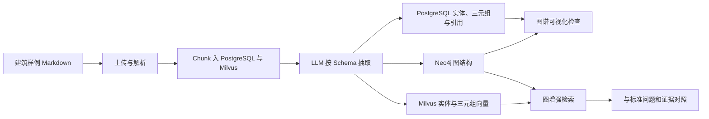

# 建筑领域知识图谱样例与开发指南设计说明

生成日期：2026-07-22

## 1. 任务目标

本任务为当前 Yuxi 的 Milvus + Neo4j 图谱链路提供一套可重复使用的建筑领域演示材料，并编写一份可长期维护的正式开发指南。

完成后，维护者应能：

1. 将样例 Markdown 文件上传到 Milvus 知识库。
2. 完成解析、Chunk 入库、LLM 图谱抽取和图谱索引。
3. 对照标准实体、标准关系和验证问题检查建图质量。
4. 启用图增强检索并验证跨文档关系召回。
5. 根据指南处理增量文件、Schema 修改、重建、删除和常见故障。
6. 根据代码地图定位抽取、存储、检索和测试扩展点。

## 2. 范围与非目标

### 2.1 本次范围

- 新建一套完全虚构、无真实个人或企业信息的建筑工程样例数据。
- 样例数据以自然语言 Markdown 为主要上传材料。
- 提供不参与上传的标准实体、标准关系和验证问题清单。
- 新增正式知识图谱开发指南并加入 VitePress“开发指南”导航。
- 更新开发变更记录，并为本次文件变更新建独立结构化日志。
- 执行样例一致性检查、文档链接检查和 VitePress 构建验证。

### 2.2 非目标

- 不修改后端图谱算法、数据库结构、API 或前端交互。
- 不调用真实模型或连接远程 Milvus、Neo4j 执行实际建图。
- 不承诺 LLM 抽取结果与标准答案数量完全一致；标准答案用于质量评审而非精确测试断言。
- 不引入 IFC、Revit、CAD、BIM 模型文件或行业本体标准的完整实现。
- 不生成真实建筑项目、企业、人员、合同或事故数据。

## 3. 方案选择

采用“自然语言样本文档 + 标准答案清单”的混合方案。

未采用的方案：

- 仅自然语言文档：接近真实资料，但无法稳定判断哪些实体和关系应被抽取。
- 仅 CSV/JSON：容易验证，但不能代表当前文档解析、Chunk 和 LLM 抽取主链路。

混合方案让上传材料保持真实文档形态，同时为人工验收提供可追溯基线。

## 4. 演示领域与数据模型

### 4.1 虚构工程

- 项目名称：滨江科创中心一期工程
- 建设地点：江州市滨江新区创新大道 88 号
- 工程性质：包含研发办公楼、实验楼和地下车库的综合建筑项目
- 所有组织、人员、合同编号、事件和日期均为虚构

### 4.2 目标实体类型

| 类型 | 说明 | 示例 |
| --- | --- | --- |
| Project | 建设项目 | 滨江科创中心一期工程 |
| Building | 建筑单体或工程区域 | 研发办公楼、实验楼、地下车库 |
| Organization | 建设、设计、施工、监理和供应单位 | 江州滨科置业有限公司 |
| Person | 项目相关人员 | 周明远、林岚 |
| Role | 项目角色 | 项目经理、总监理工程师 |
| Technology | 工艺、平台或技术 | BIM 协同平台、装配式施工 |
| Material | 建筑材料 | C40 商品混凝土、HRB400E 钢筋 |
| Equipment | 设备或系统 | 磁悬浮冷水机组、塔式起重机 |
| Contract | 合同 | 施工总承包合同、钢筋采购合同 |
| Event | 质量、安全、进度或变更事件 | 地下车库渗水整改事件 |

### 4.3 目标关系类型

| 类型 | 方向示例 | 说明 |
| --- | --- | --- |
| DEVELOPS | Organization → Project | 建设或开发项目 |
| DESIGNS | Organization → Project/Building | 设计项目或单体 |
| CONSTRUCTS | Organization → Project/Building | 施工承建 |
| SUPERVISES | Organization/Person → Project | 监理或监督 |
| SUPPLIES | Organization → Material/Equipment | 供应材料或设备 |
| WORKS_AT | Person → Organization | 人员任职关系 |
| SERVES_AS | Person → Role | 人员担任角色 |
| PARTICIPATES_IN | Person/Organization → Project | 参与项目 |
| RESPONSIBLE_FOR | Person/Organization → Building/Event | 负责单体、专业或整改 |
| USES | Project/Building → Technology/Material/Equipment | 项目采用某项资源 |
| LOCATED_IN | Building → Project | 单体隶属项目 |
| GOVERNED_BY | Project/Organization → Contract | 项目或单位受合同约束 |
| AFFECTS | Event → Building/Project | 事件影响对象 |
| RECTIFIED_BY | Event → Organization/Person | 事件整改责任方 |

## 5. 文件设计

### 5.1 样例数据目录

目录：`docs/public/examples/knowledge-graph-construction-demo/`

| 文件 | 是否上传 | 职责 |
| --- | --- | --- |
| `README.md` | 否 | 数据集说明、上传顺序和文件用途 |
| `01-project-overview.md` | 是 | 项目、地点、建设单位、单体和关键指标 |
| `02-participants.md` | 是 | 参建单位、人员、任职和项目角色 |
| `03-buildings-and-technologies.md` | 是 | 建筑单体、结构、工艺和技术依赖 |
| `04-contracts-and-suppliers.md` | 是 | 合同、供应单位、材料和设备关系 |
| `05-quality-and-safety-events.md` | 是 | 质量安全事件、影响对象和整改责任 |
| `06-progress-and-changes.md` | 是 | 进度节点、设计变更和跨单位协作 |
| `expected-entities.csv` | 否 | 预期核心实体及其证据文件 |
| `expected-relations.csv` | 否 | 预期核心三元组及其证据文件 |
| `validation-questions.md` | 否 | 普通检索、图检索和跨文档验证问题 |

只有编号为 `01` 至 `06` 的 Markdown 文件用于上传。标准答案文件不得上传，避免答案清单污染被测图谱。

### 5.2 正式指南与导航

| 文件 | 操作 | 职责 |
| --- | --- | --- |
| `docs/develop-guides/knowledge-graph-development.md` | 新建 | 完整构建、验证、维护和扩展教程 |
| `docs/.vitepress/config.mts` | 修改 | 在“开发指南”分组增加知识图谱开发入口 |
| `docs/develop-guides/changelog.md` | 修改 | 记录新增教程和建筑样例数据 |
| `docs/change_logs/change_YYYY-MM-DD_HH-mm-ss.md` | 新建 | 按项目技能记录本次真实文件变更 |

## 6. 正式指南结构

正式指南必须覆盖：

1. 当前 Milvus + Neo4j + PostgreSQL 架构和适用边界。
2. `LITE_MODE`、管理员权限、模型与基础设施前置条件。
3. 建筑领域实体、关系和 Schema 设计方法。
4. 样例数据获取、上传范围和推荐试建顺序。
5. 创建 Milvus 知识库、上传、解析和入库步骤。
6. 配置 LLM 抽取器、模型参数和并发数。
7. 图谱构建状态、失败重试、重置和增量更新。
8. 图谱可视化检查和标准答案人工评审方法。
9. 启用图增强检索及实体、三元组、PPR、RRF 参数说明。
10. 使用样例问题进行普通检索与图检索对照。
11. 管理 API 路径和不包含真实凭据的 PowerShell/cURL 示例。
12. 删除文件、修改 Schema、更换模型、重建和版本维护策略。
13. 常见故障、判断依据和对应检查路径。
14. 抽取器、图服务、图向量、仓储、路由和前端代码地图。
15. 单元、集成和端到端测试建议。
16. 当前限制：LLM 非确定性、两跳局部子图、跨存储一致性和图检索默认关闭。

## 7. 数据流与使用流程

推荐执行顺序：

1. 创建 Milvus 知识库。
2. 先上传 `01`、`02`、`03` 三份文件完成首次试建。
3. 对照核心实体和关系检查 Schema。
4. 质量符合预期后上传 `04`、`05`、`06`，再次构建待处理 Chunk。
5. 启用图检索，用跨文档问题验证关系扩散效果。

## 8. Schema 设计

指南提供可直接复制的建筑领域 Schema，要求：

- 实体类型只使用本设计中的英文类型名称。
- 关系类型只使用本设计中的英文大写名称。
- 企业使用完整名称，人员使用完整姓名。
- 不把日期、金额、面积等普通属性强制建成实体。
- 没有原文证据时不得推测关系。
- 关系方向固定，避免同一语义出现正反两套关系。
- BIM 可作为 Technology；具体软件平台使用其完整名称。
- 同一材料采用统一名称和强度等级表示。

## 9. 验证设计

### 9.1 静态验证

- 所有样例文件必须声明“完全虚构”。
- 核心组织、人员和项目名称在各文件中拼写一致。
- `expected-relations.csv` 的 source/target 必须存在于 `expected-entities.csv`。
- 每条标准关系必须指定至少一个证据文件。
- 指南中的文件链接和代码链接必须可解析。
- 文档中不得出现真实 Token、密码或 `.env` 敏感值。

### 9.2 图谱人工验收

- 项目、三栋建筑和核心参建单位应能被抽取。
- 至少一个人员关系必须跨参建单位文档和事件文档重复出现。
- 至少一个材料供应关系必须连接供应商、材料和使用单体。
- 至少一个事件必须连接影响单体和整改责任方。
- 图谱中的核心关系应能回溯到原始文件和 Chunk。
- 实体或关系数量允许因模型不同而变化，不以精确数量作为成功条件。

### 9.3 检索验收

验证问题分为：

- 单文档事实问题：确认基础向量检索可用。
- 跨文档关系问题：确认图检索能串联组织、人员、建筑和事件。
- 无答案问题：确认系统不会因图谱存在而编造无证据关系。

## 10. 异常与维护策略

- 抽取结果类型混乱：先收紧 Schema，使用少量文件重建，不直接上传全量数据。
- 模型限流：降低 `concurrency_count`，保留失败 Chunk 后重新开始索引。
- 修改 Schema 或模型：变更只影响待处理 Chunk；需要全库一致时执行重置后重建。
- 删除文件：通过知识库文件管理删除，依赖现有引用与孤立实体清理链路，不直接操作 Neo4j。
- 跨存储不一致：检查 Chunk 的 `graph_indexed`、PostgreSQL 图谱记录、Milvus 图集合和 Neo4j 节点；不增加静默回退。
- 图谱建成但问答未使用：检查检索配置中的 `use_graph_retrieval` 是否保存为启用。
- API 进程重启：当前图谱构建由 API 进程内 `Tasker` 执行，长任务期间应保持 API 稳定。

## 11. 验收清单

- [ ] 10 个样例目录文件全部存在，且只有 6 个编号 Markdown 标记为上传材料。
- [ ] 样例数据覆盖设计中的实体与关系类型，跨文件名称一致。
- [ ] 标准关系的实体引用和证据文件检查通过。
- [ ] 正式指南覆盖界面、API、验证、维护、排障和代码扩展。
- [ ] VitePress 导航包含“知识图谱开发”。
- [ ] 开发变更记录和独立变更日志已更新。
- [ ] VitePress 文档构建成功。
- [ ] Git diff 只包含本任务文档和样例文件，不修改业务代码。
